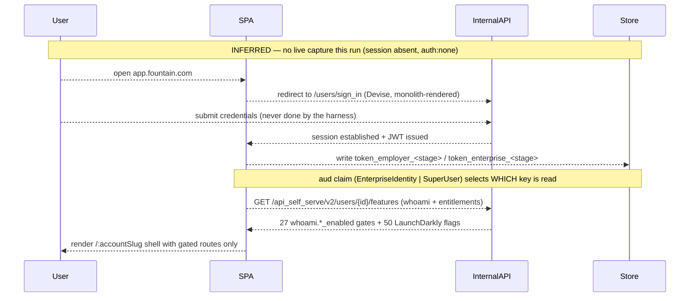
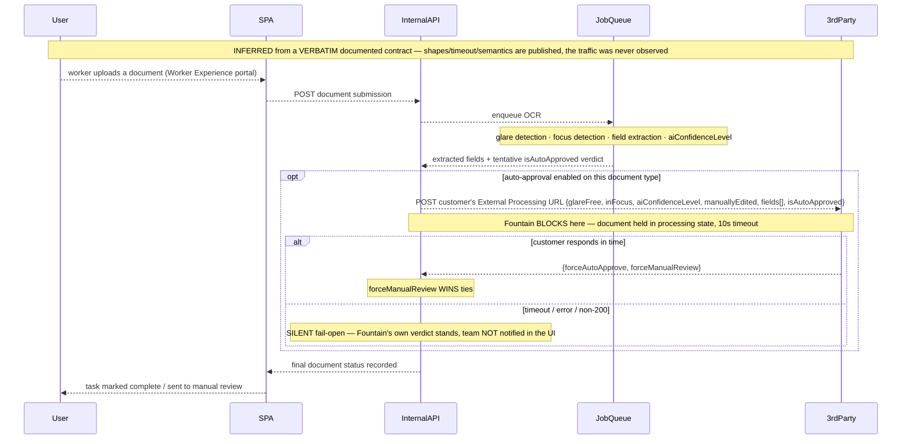
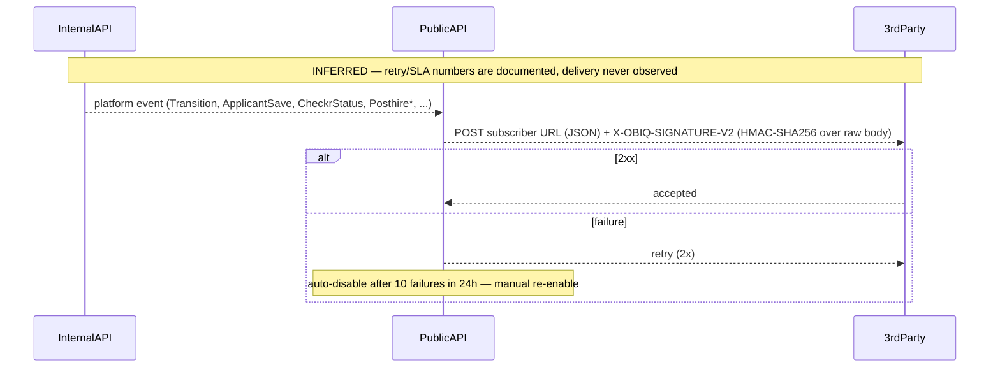
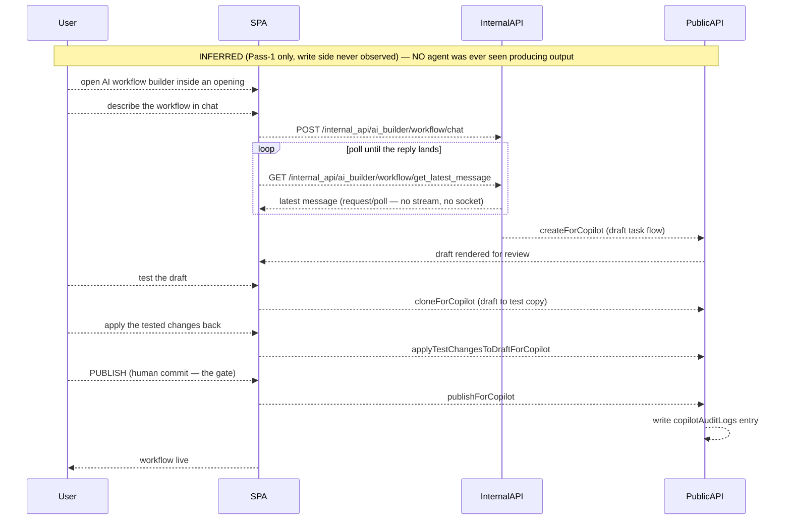
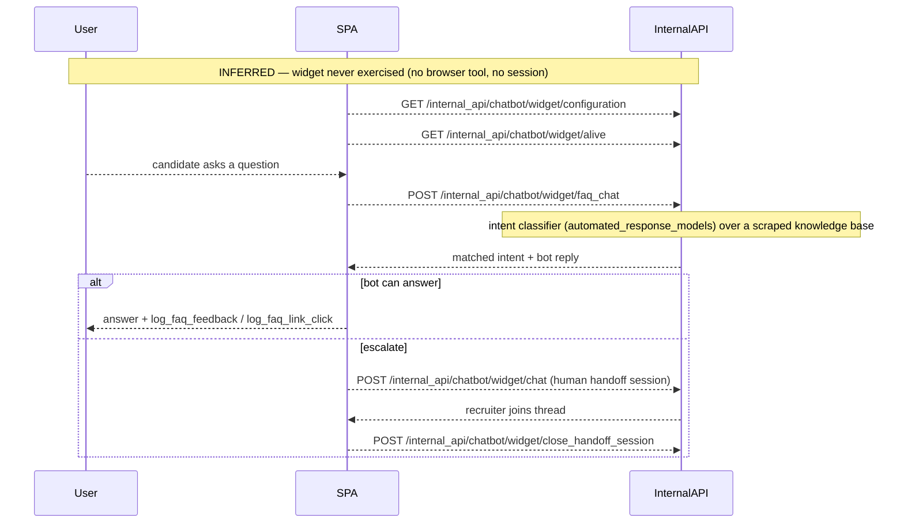

# Fountain — UX Flows

<!-- Cartography (Mode 4), artifact 2 of 3 · governed by .claude/rules/cartography-flows.md
     compiled 2026-08-09 · EVERY FLOW IS INFERRED — zero live wire observed on this run -->

> ## ⚠️ Every diagram in this document is INFERRED. None was observed.
>
> `cartography-flows.md` traces journeys from the **observed wire** captured by the `session` dimension.
> **This run has no observed wire at all.** `session` is `status: absent`
> (`auth:none`, `write_side_observed: false`, `pass2: not-applicable`) and `wire-capture` is
> `status: folded` into it — **no request, response, header or frame was observed anywhere on this
> target.** On top of that, the **Chrome/browser-driving MCP tools are absent from this session entirely**
> (capability gap, confirmed by tool search), so even an unauthenticated tap of the public career-site or
> chat widget was impossible.
>
> **Therefore the write-side rule in `cartography-flows.md` §Diagram-rules-6 is applied at its maximum:
> every arrow in every diagram below is drawn dashed (`-->>`) and every diagram carries an explicit
> `Note over … : INFERRED` marker** — including the read hops, because on a zero-observation run the
> reads are no better evidenced than the writes. The usual solid-request/dashed-response convention is
> deliberately **suspended**; direction is carried by the label instead. Drawing any hop solid here would
> be a Mode-5 Cartography defect.
>
> **What the flows *are* traced from** (each hop is anchored inline):
>
> | Source | What it contributes | Grade |
> | --- | --- | --- |
> | `deployed-client-bundle: _shared/api-path-catalog.md` + `raw/route-table.md` | the **call sites** — **766** app-own paths: 300 recovered verbatim from the recruiter console's generated API client (+ the route each belongs to), plus **466 `/api/service*` paths across 15 families** from the `wx-navbar` / `wx-copilot` micro-frontends (Mode-5 it. 1). **The flows below are drawn from the 300** — the WX 466 arrived after these diagrams and belong to product surfaces (Shift, Pulse, Onboard, Compliance) whose journeys this run never traced; that is a **recorded coverage gap in this document**, not a silent omission. | `source-map-reassembly` · **high** for the 300 · `bundle-string-mine` · medium for the 466 (that the path exists in the client; **not** that it fires) |
> | `docs`/`api`: `raw/webhooks.md`, `raw/api-reference.md`, `raw/endpoint-catalog.md` | the **contracts** — documented request/response shapes, state machines, timeouts, override semantics | `docs-reconstructed`, 41 rows `openapi-verbatim` · medium(-high) |
> | `bundle: raw/bundle-map.md`, `raw/env-config.md` | vendor wiring (Stripe SetupIntent, Pusher, Cronofy, HelloSign) | `source-map-reassembly` · high |
> | `bundle: raw/wx-micro-frontends.md` **(Mode-5 iteration 1, new)** | the Cue copilot's own client config — panel set, a Claude-via-Bedrock model-selection enum, and a live (unauth, read-only-probed) MCP tool server | `bundle-string-mine` · medium for the string-mined config; the MCP `initialize`/`tools/list` responses are a **direct live observation**, high confidence for THEIR OWN existence — not for whether flow 5 actually invokes them. **(Mode-5 it. 2 adds a SECOND live server** — `fountain-hire-mcp-server` at `mcp.fountain.com`, **127** tools — which is the *Hire* agent-tool surface, not Cue's analytics one; no flow below was re-traced against it, so it is cited here and not diagrammed.**)** |
>
> **A generated API client proves completeness, not liveness** (`README.md` lesson 7). Every "SPA calls
> X" hop below means *the client contains a call site for X*, never *X was seen firing*.

---

## TL;DR — how Fountain gets work done

Fountain's work model is **synchronous REST over a Rails monolith for everything the recruiter does**,
with the interesting behaviour pushed to the edges. Three shapes recur:

1. **Recommend-then-accept, not autonomous.** The two most "agentic"-marketed loops — sourcing budget and
   AI workflow authoring — both resolve on the wire to *the system proposes, a human commits*:
   `budget_recommendation` → `accept_recommendation` / `reject_recommendation`, and `createForCopilot` →
   `cloneForCopilot` → `applyTestChangesToDraftForCopilot` → `publishForCopilot` → `copilotAuditLogs`.
2. **Request/poll, not streaming.** The AI builder's own transport is a POST plus a
   `get_latest_message` poll — there is **no SSE and no documented socket** on the copilot path.
3. **One genuine synchronous decision gate exists, and it is in compliance, not in AI.** The document
   OCR pipeline **blocks** on a call to the *customer's* URL that can override Fountain's own AI verdict
   (`forceAutoApprove` / `forceManualReview`, 10 s timeout, silent fail-open). It is the only journey on
   this target with a published, precise contract — inputs, confidence score, override semantics, timeout
   and failure mode — rather than a persona name.

Everything specialized is **brokered**: Stripe for ad-spend, VONQ/Indeed for distribution, Cronofy for
scheduling, Checkr/Onfido for screening, HelloSign/DocuSign for signature, Looker for BI. Fountain is the
system of record and the workflow layer over that stack.

---

## Participant mapping (the black-box vocabulary, pinned to Fountain's actual hosts)

Names are identical across every diagram, per `cartography-flows.md`.

| Participant | On this target |
| --- | --- |
| `User` | the human acting in the flow — a **recruiter/admin** unless the flow header says candidate/worker |
| `SPA` | the browser client — `recruiter_ui` at `app.fountain.com`, **or** the Worker Experience portal (stated per flow) |
| `InternalAPI` | the app's own API, **same-origin as the web app** (`web.fountain.com` in prod) under `/internal_api/*` (267 paths) + `/api_self_serve/{v1,v2}` (33) — a **Rails/Devise monolith** |
| `PublicAPI` | the published developer API — `api.fountain.com` (Hire v2, `X-ACCESS-TOKEN`) and `services.fountain.com` (Fountain One, OAuth2 Bearer). **A different host from `InternalAPI`, with a near-disjoint operation set** |
| `JobQueue` | async server-side work (OCR, exports, campaign sync) — **inferred from endpoint shape** (`exports`, `timestamped_exports`, status-polling paths), never observed |
| `Realtime` | **Pusher** — wired via `REACT_APP_PUSHER_APP_KEY`/`_CLUSTER`; **zero frames observed** |
| `3rdParty` | the brokered vendor in that flow — named in the diagram label (Stripe · VONQ · Indeed · Cronofy · Checkr/Onfido · HelloSign/DocuSign · **the customer's own External Processing URL**) |
| `Store` | browser storage — `token_employer_<stage>` / `token_enterprise_<stage>` in **both** localStorage and sessionStorage |

---

## Flow index

| # | Flow | Category | Trigger | Participants | Complexity | Observed? |
| --- | --- | --- | --- | --- | --- | --- |
| 1 | Sign-in → dual-tier JWT → authed read | Auth & session | user submits Devise sign-in | User · SPA · InternalAPI · Store | moderate | **inferred** |
| 2 | Application → stage graph → hire | Core action | candidate applies / recruiter advances | User · SPA · InternalAPI · PublicAPI · 3rdParty | **complex** | **inferred** |
| 3 | Sourcing spend → job-ad purchase (Stripe/VONQ) | Core action | recruiter buys distribution for a job | User · SPA · InternalAPI · 3rdParty | **complex** | **inferred** |
| 4 | Document upload → OCR → external-processing override | Data pipeline | worker uploads a compliance doc | User · SPA · InternalAPI · JobQueue · 3rdParty | **complex** | **inferred** |
| 5 | Cue: AI drafts → human tests → human publishes | AI | recruiter opens the AI workflow builder | User · SPA · InternalAPI · PublicAPI | **complex** | **inferred** |
| 6 | Candidate chat / Chat-Apply → FAQ bot → human handoff | AI | candidate opens the widget | User · SPA · InternalAPI | moderate | **inferred** |
| 7 | Outbound webhook delivery (4 mechanisms + HMAC) | Data pipeline | any subscribed platform event | InternalAPI · PublicAPI · 3rdParty | moderate | **inferred** |
| 8 | Applicant → Worker activation (the two-spine seam) | Configuration | recruiter/API hires an applicant | User · InternalAPI · PublicAPI · 3rdParty | moderate | **inferred** |
| — | Realtime channel lifecycle | Realtime | — | Realtime | — | **NOT DIAGRAMMABLE — see § Realtime** |

**8 of 9 identified journeys diagrammed** → `flow_coverage: 89`.

---

## Auth & session flows

### 1. Sign-in → dual-tier JWT → authed read

**Trigger:** user submits credentials · **Surface:** `/users/sign_in` (monolith, outside the SPA) →
`/:accountSlug` · **Observed?** inferred (no session; the auth *transport* is unverifiable this run).



**Notes.**
- **Two auth tiers share one token shape**, disambiguated *client-side* by the JWT `audience` claim
  (`utils/wxJwtToken.js`, `bundle: raw/route-table.md · high`). Tokens are written to **both**
  localStorage and sessionStorage — JS-readable, so XSS-reachable.
- **What is inferred and material:** whether the app actually sends `Authorization: Bearer` or relies on
  the same-origin Rails session cookie is **unresolved** — the tokens' presence does not prove the
  transport (`tradecraft.md` §2.26: a readable token ≠ token auth). A single authed read with each
  credential dropped would settle it. Recorded as the top auth open question.
- A legacy `containers/Auth_old/*` still ships alongside this flow — a mid-migration auth system.
- The **published** API uses different schemes entirely: `X-ACCESS-TOKEN` (Hire v2) and OAuth2
  client-credentials Bearer (Fountain One). Three auth models across three generations.

---

## Core action flows

### 2. Application → stage graph → hire

**Trigger:** a candidate applies (career site / Chat-Apply) and a recruiter works the stage board ·
**Surfaces:** career site → `/jobs/:jobId/v2/stages/:stageExternalId?` (D1) → `/applicants/:id/edit`
(D2) · **Observed?** inferred.

```mermaid
sequenceDiagram
    participant User
    participant SPA
    participant InternalAPI
    participant PublicAPI
    participant 3rdParty
    Note over User,3rdParty: INFERRED — no live capture this run; hops are client call sites + documented contracts
    User-->>SPA: candidate submits application (career site or Chat-Apply)
    SPA-->>InternalAPI: POST /internal_api/portal/{slug}/application_forms
    InternalAPI-->>SPA: applicant created, placed on stage 1
    Note over InternalAPI: rule stage may auto-screen / auto-distribute here
    User-->>SPA: recruiter opens the stage board
    SPA-->>InternalAPI: GET {API_V2}/jobs/{jobId}/stages
    InternalAPI-->>SPA: stage graph + applicant counts
    loop per applicant worked
        User-->>SPA: advance / reject / message
        SPA-->>InternalAPI: POST /api_self_serve/v2/applicants/{id} transitions
        InternalAPI-->>PublicAPI: Transition webhook event emitted
    end
    opt interview stage
        SPA-->>3rdParty: Cronofy — book slot
        3rdParty-->>SPA: booking confirmed
    end
    opt background-check stage
        InternalAPI-->>3rdParty: Checkr / Onfido — create invitation
        3rdParty-->>InternalAPI: CheckrStatus / OnfidoStatus webhook
    end
    opt offer stage
        User-->>SPA: generate offer letter from template
        SPA-->>InternalAPI: POST /internal_api/offer_letters/{id}/submit_for_approval
        InternalAPI-->>SPA: routed through /internal_api/approvals/rules
    end
    SPA-->>User: applicant reaches hired stage
```

**Notes.**
- The **stage graph is per-Opening**, authored at D3 in the workflow editor; auto-screening is a *rule
  stage* inside it (`DistributeApplicantsRuleStage`), not a platform-level agent.
- **Two workflow concepts share the word "workflow"**: Hire's *Workflow* is this stage graph;
  Onboard's *TaskFlow* is a task sequence in a different service (`data-model-api-surface.md`).
- `alt` branches for conflict/permission are **not drawn** because no error envelope was ever observed on
  this path; the two documented envelopes (flat `{error:{msg,name}}` for Hire v2, JSON:API array for the
  `service*` fleet) are recorded in `data-model-api-surface.md` instead of guessed into the diagram.
- **What is inferred and material:** the entire write side — the exact create/advance bodies, what the
  server resolves vs what the client sends, and whether the rule stage fires synchronously.

### 3. Sourcing spend → job-ad purchase (Stripe SetupIntent → VONQ)

**Trigger:** recruiter marks an opening for sourcing and buys distribution · **Surfaces:** `/sourcing`
(D0?) → `/jobs/:jobId/sourcing/new` (D2) · **Observed?** inferred. **This is the only money-taking write
surface in the recruiter console.**

```mermaid
sequenceDiagram
    participant User
    participant SPA
    participant InternalAPI
    participant 3rdParty
    Note over User,3rdParty: INFERRED — no live capture; NEVER triggered (cost/state gate, ingestion §7 rule 4)
    User-->>SPA: mark opening for sourcing
    SPA-->>InternalAPI: POST /internal_api/sourcing/openings/mark_for_sourcing
    SPA-->>InternalAPI: GET .../openings/{slug}/suggested_target_budget
    SPA-->>InternalAPI: GET .../openings/{slug}/budget_recommendation
    InternalAPI-->>SPA: recommended budget + historical_conversion_data
    Note over User,InternalAPI: RECOMMEND-then-ACCEPT — not the marketed "automatic budget adjustments"
    User-->>SPA: choose channels
    SPA-->>InternalAPI: GET /internal_api/sourcing/vonq/contracts/channels
    InternalAPI-->>3rdParty: VONQ — channel catalog + posting requirements
    User-->>SPA: enter card (or select "invoiced")
    SPA-->>3rdParty: Stripe — confirm SetupIntent (card-on-file)
    3rdParty-->>SPA: payment method saved
    SPA-->>InternalAPI: POST /internal_api/sourcing/sourcing_purchases/bulk_create
    InternalAPI-->>3rdParty: VONQ / Indeed — place campaign
    InternalAPI-->>SPA: sourcing_purchase created
    loop campaign lifecycle
        SPA-->>InternalAPI: GET .../sourcing_purchases/{id}/campaign_details
        User-->>SPA: accept_recommendation / reject_recommendation
    end
```

**Notes.**
- **SetupIntent, not PaymentIntent** — Fountain saves a card for later billing rather than charging at
  purchase (`bundle: raw/bundle-map.md · high`). A coupon path and an "invoiced" alternative exist.
- Fountain's **own SaaS subscription** billing is a *different* vendor (Chargebee) — two decoupled money
  flows, deliberately separated.
- **This flow was never triggered.** Locating a feature never requires firing it (`cartography.md`); a
  purchase is a cost + state change behind the Pass-2 confirmation gate.
- **What is inferred and material:** everything after "enter card". The Stripe hop is read off the client
  wiring, not observed.

---

## Data pipeline flows

### 4. Document upload → OCR → **synchronous external-processing override**

**Trigger:** a worker uploads a compliance document · **Surface:** Worker Experience portal (SPA = the
**portal**, not the recruiter console) · **Observed?** inferred — **but this is the one flow with a
published, precise contract** (`docs: raw/webhooks.md · docs-reconstructed · medium-high`).



**Notes.**
- This is the **only synchronous, outcome-changing integration hook** on the platform — every other
  integration is a fire-and-forget webhook. It inverts the usual direction: **the customer's code can
  override Fountain's AI**.
- Fountain documents its own footgun: a buggy fallback returning `{true, false}` would **silently approve
  every document** on the customer's error path; the recommended safe default is `{false, false}`.
- **What is inferred and material:** the OCR is asserted as a `JobQueue` hop from endpoint shape and the
  documented "held in processing state" language; the async boundary itself was not observed. The OCR
  **vendor** is unnamed (Onfido does identity-document OCR elsewhere in the product — unresolved).

### 7. Outbound webhook delivery

**Trigger:** any subscribed platform event · **Surfaces:** `/webhooks` (recruiter settings) + three other
independently-configured mechanisms · **Observed?** inferred.



**Notes.**
- **Four independent webhook mechanisms** with *different* delivery semantics — Hire (2 retries /
  10-failure disable), Custom Attribute (**3-second SLA**, tightest on the platform), Automation
  (signing key **or** a custom Authorization header), Universal Tasks (Onboard). The differing numbers
  are the evidence they are **not** one unified event bus.
- The signature header `X-OBIQ-SIGNATURE-V2` carries the pre-rebrand codename — one of three independent
  "OnboardIQ/OBIQ" tells still in production.
- A published static **egress IP allowlist (15 AWS IPs)** exists for customers who allowlist inbound —
  itself an independent AWS-hosting confirmation.
- `send_secure_data` is an explicit per-webhook opt-in to include PII in payloads.

---

## Configuration flows

### 8. Applicant → Worker activation (the two-spine seam)

**Trigger:** an applicant is hired · **Surface:** stage board / API · **Observed?** inferred.

```mermaid
sequenceDiagram
    participant User
    participant InternalAPI
    participant PublicAPI
    participant 3rdParty
    Note over User,3rdParty: INFERRED — the seam is documented (2 mechanisms only); no traffic observed
    User-->>InternalAPI: advance applicant to hired
    InternalAPI-->>PublicAPI: POST /v2/workers/{id}/activate
    Note over PublicAPI: Applicant spine (Hire v2) → Worker spine (Fountain One, 12 documented of 19+ services)
    PublicAPI-->>3rdParty: PosthireWorkerActivation webhook
    PublicAPI-->>InternalAPI: worker record available via GET /v2/workers/{id}
    Note over InternalAPI,PublicAPI: identifier schemes differ across the seam (id/external_id/slug vs uuid)
```

**Notes.**
- **The platform is joined at a narrow waist**: exactly two documented mechanisms bridge the two entity
  spines — `activate`/`deactivate` plus four `Posthire*` webhook events. Everything downstream
  (onboarding task flows, shifts, surveys, compliance) hangs off the Worker spine, in the **application
  this run never mapped**.
- **What is inferred and material:** whether the recruiter console fires this itself or the monolith does
  it internally on the hired transition. No client call site for `/v2/workers/*` appears in the
  recruiter console's 300-path catalog **nor in the 466 WX service-tier paths (checked it. 2)** —
  the absence now holds across both mined client tiers, which strengthens the "server-internal" read,
  though it remains an inference from an absence.

---

## AI flows

### 5. Cue — AI drafts → human tests → human publishes

**Trigger:** recruiter opens the AI workflow builder · **Surface:**
`/openings/:funnelSlug/ai_workflow_builder` (**D3**, gated `ai_workflow_builder_enabled`) ·
**Observed?** inferred — **and this is the flow the run most wanted to observe and could not.**



**Notes.**
- **The API shape is the finding.** `createForCopilot → cloneForCopilot →
  applyTestChangesToDraftForCopilot → publishForCopilot`, with a dedicated `copilotAuditLogs` resource, is
  a **draft → test → human-publish → audit** loop. That is meaningfully *less* autonomous than "Cue
  orchestrates agents to run hiring, onboarding, and support workflows end to end, without manual work"
  — and meaningfully *more* real than a relabeled rules engine. **Nobody builds a governance audit table
  for a rules engine.**
- **Request/poll, not streaming** — `chat` + `get_latest_message` is a polling pair. No SSE, no socket on
  this path.
- **(Mode-5 iteration 1) The separately-deployed `wx-copilot.umd.js` micro-frontend WAS subsequently
  fetched and mined** — the panel set (New chat, Chats, Scheduled, Setup assistant, Skills & Connectors)
  is now known (`raw/wx-micro-frontends.md`), though this specific diagrammed flow (the D3 in-opening
  `ai_builder/workflow/chat` polling loop, on the OLD monolith host) is architecturally DISTINCT from
  Cue's own client (which talks directly to the `/api/service*` microservice tier + an MCP tool server,
  never `/internal_api/*`) — so the new mine does not directly map this specific flow's internals, it
  maps a sibling one (Cue's own chat, not diagrammed separately here — see the note below).
- **What is inferred and material:** the exact drafting/quality behaviour of THIS flow (the D3
  ai_workflow_builder) remains unobserved — `write_side_observed: false` caps it at tentative. **However,
  "whether an LLM is involved at all" is no longer an open question for the Cue subsystem as a whole**:
  `wx-copilot.umd.js` embeds a literal model-selection enum (`us.anthropic.claude-opus-4-6-v1`,
  `us.anthropic.claude-sonnet-4-6` — AWS Bedrock) and a multi-provider (`openai`/`anthropic`/
  `anthropic_direct`) config schema, plus a live, unauthenticated MCP tool server (`fountain-data-mcp`,
  confirmed via `initialize`+`tools/list`, read-only). This is a **static configuration fact, not an
  observed trace of this flow executing** — it says Cue genuinely *can* call an LLM and MCP tools, not
  that it did so for this drafting step — so the diagram below stays fully dashed/inferred per the
  write-side rule. Full detail: `raw/wx-micro-frontends.md` §2c–2d.

### 6. Candidate chat / Chat-Apply → FAQ bot → human handoff

**Trigger:** candidate opens the widget (web / SMS / WhatsApp) · **Surface:** the embedded chat widget;
administered from `/chatbot` (D0?) · **Observed?** inferred.



**Notes.**
- **The escalation path is a first-class endpoint** (`close_handoff_session`) — the bot is *designed* to
  hand off, which is a design statement about its confidence envelope.
- **Mechanism read:** the admin surface exposes `automated_response_models`,
  `get_intents_with_bot_reply/{model_name}`, `update_intent/{faqbot_log_id}` and career-site scraping
  refresh — the anatomy of an **intent classifier with a scraped KB**, independently corroborated by
  `euw3-ms-nlu.internal.fountain.com`, an in-house NLU microservice (`infra · medium`). This is the
  in-product reality behind the "Emma" persona, and it argues **against** the open-ended-agent framing.
- **What is inferred and material:** the actual reply quality, whether an LLM sits behind
  `automated_responses`, and whether Chat-Apply shares this transport across SMS/WhatsApp.

---

## Realtime — identified, **not diagrammable**

**This is a recorded negative, not a miss.** Per `cartography-flows.md`, a realtime finding may be the
absence — but on this target we cannot even assert absence:

| Signal | Status |
| --- | --- |
| `REACT_APP_PUSHER_APP_KEY` + `REACT_APP_PUSHER_CLUSTER` wired into the recruiter client | **present** (`bundle: raw/env-config.md · source-map-reassembly · high`) |
| Pusher listed in the response CSP-Report-Only vendor set, **4 regions** | **present** (`bundle: raw/bundle-map.md · high`) |
| Channel names, event catalog, frame shapes, subscription lifecycle | **ZERO** — no socket was ever opened by this run |
| An SSE/long-poll alternative on the AI path | **ruled out by shape**, not by observation — the AI builder polls `get_latest_message` |

So the honest statement is: **Fountain's recruiter console has a realtime channel that this run proved
exists and learned nothing else about.** Drawing a lifecycle diagram from a config key would be
fabrication. One authenticated Pass-1 session with the WebSocket tap installed pre-navigation would
produce the entire catalog (`tradecraft.md` tap 2 + tap 4).

---

## Cross-dimension reconciliation — the flow as the app runs it vs as the docs describe it

| Journey | Published/documented version | App-own version (from the client) | Read |
| --- | --- | --- | --- |
| **Applicant pipeline** | Hire v2 REST: `/v2/applicants`, `advance`, `bulk-advance`, `transitions`, 14 webhook types (`api` · medium, 41 rows verbatim) | `/api_self_serve/v2/applicants/*` + `/internal_api/stages` + a hand-written `${API_V2}/jobs/{id}/stages` | **Different hosts, overlapping intent.** The published API is an integration contract; the console runs on its own same-origin API. Both **declared**, neither observed. |
| **Sourcing / ad spend** | **no published equivalent at all** (52 app-own paths, 0 published) | `/internal_api/sourcing/*` | The published API cannot buy job ads. Whole subsystem is console-only. |
| **Chatbot administration** | **no published equivalent** (29 app-own paths, 0 published) | `/internal_api/chatbot/*` | Same. |
| **Workflow authoring** | `servicetodo` Copilot lifecycle **is** published (`createForCopilot` …) | `/internal_api/ai_builder/workflow/chat` + `/internal_api/workflow_editor/*` (28) | **The one AI loop that spans both surfaces** — the authoring lifecycle is public, the chat transport is not. |
| **Compliance override** | fully published, with timeout + tie-break semantics | no client route located in the mapped console | The best-documented flow has **no located UI** in the app this run mapped — it lives in the second application. |
| **Realtime** | **not documented anywhere** in 593 doc pages | Pusher keys in the client | Published surface is silent on realtime; the app has it. Drift, unresolvable without a session. |

**Drift verdict:** the published API and the *recruiter console's* app-own API are **near-disjoint** (575
documented endpoints on `services.fountain.com`/`api.fountain.com` vs 300 app-own paths on
`web.fountain.com`) — a scoping the WX lane sharpens: the **466** `/api/service*` paths the WX
micro-frontends call *do* share the published path family (Mode-5 it. 1), so the disjointness is a fact
about the Hire console, not the whole client tier. For most
journeys there is no "published version" to drift *from*. Where a published contract exists it is
rendered as **fact about the contract** (it is a served artifact); every claim about what actually
travels the wire stays **tentative**.

---

## Open questions

1. **Does any of this fire?** Every hop is a call site or a contract. One read-only Pass-1 session with a
   pre-navigation fetch/XHR tap would convert the majority of this document from declared to observed.
2. **What is the auth transport** — Bearer header or same-origin Rails session cookie? (Settle by
   credential-drop replay, `ingestion §9.4`.)
3. **What does the Pusher channel carry** — content streaming, or cache-coherence pings that trigger REST
   refetches? (`tradecraft.md` §2.4 names both patterns; neither is evidenced.)
4. ~~**Is there an LLM anywhere in flows 5 and 6**, or is the whole AI layer intent-classification + NLU?~~
   **PARTIALLY RESOLVED for the Cue subsystem (Mode-5 iteration 1, static evidence only):**
   `wx-copilot.umd.js` embeds a concrete Claude-via-Bedrock model-selection enum
   (`us.anthropic.claude-opus-4-6-v1`/`us.anthropic.claude-sonnet-4-6`) and a multi-provider
   (`openai`/`anthropic`/`anthropic_direct`) config schema — genuine LLM infrastructure exists and is
   wired in. **This is a configuration fact, not an observed invocation** — it does not by itself prove
   flow 5's specific draft/test/publish loop calls it (still `write_side_observed: false`), and it does
   **not** extend to flow 6 (Emma): that surface's intent-classifier + in-house-NLU-host evidence is
   unchanged and still points away from open-ended generation for THAT flow specifically. See
   `raw/wx-micro-frontends.md` §2c.
5. **Where does the OCR run and whose engine is it?** `JobQueue` is inferred; the vendor is unnamed.
6. **Does the recruiter console call `/v2/workers/activate` itself**, or does the monolith bridge the
   seam server-side? No client call site exists — an absence, not a proof.
7. **What are the write bodies?** No create/advance/publish body was ever seen on this target; the
   diagrams show the *paths*, never the payloads.
