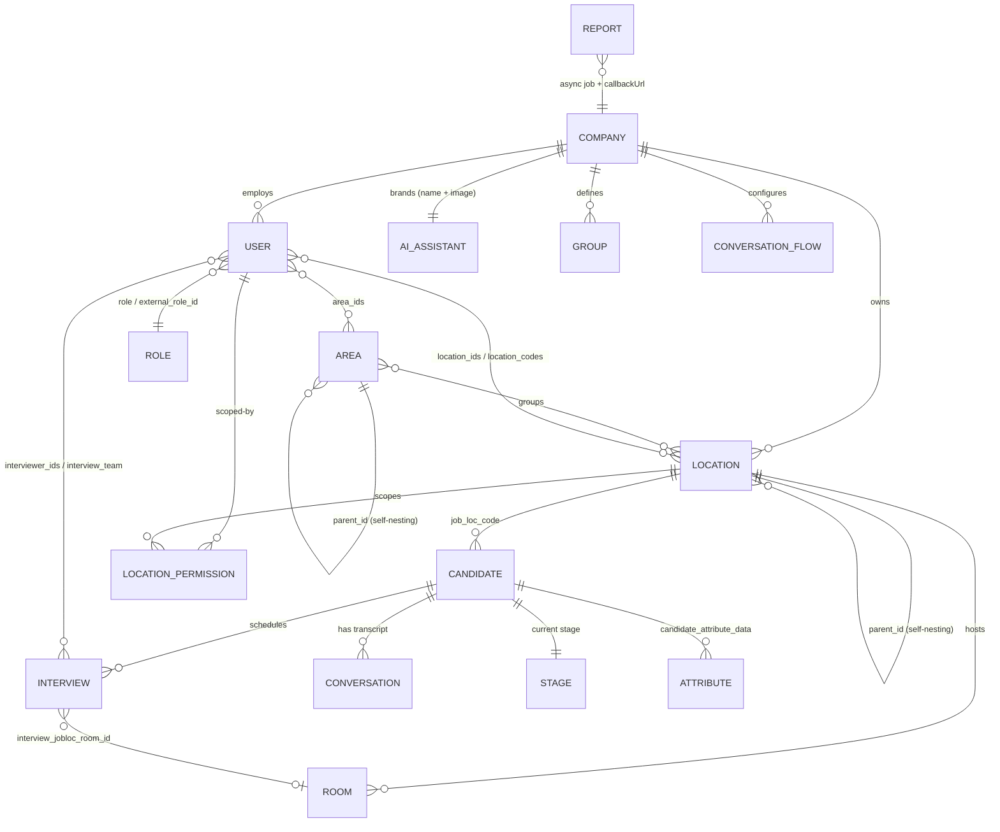

# Paradox — Data Model & API / SDK Surface

> **Provenance ceiling for this document (read first).** This run has `auth: none` — `session` is
> `status: absent` and `wire-capture` is `status: folded` into it
> (session: `_summary.md` · inferred · high · `completeness_pct: 0`; wire-capture: `_summary.md` ·
> folded). **Nothing below was observed on a live wire.** Every path, field, and envelope comes from one
> of two *static* lanes: a **served, machine-parseable partner spec** (`api` · openapi-verbatim · high)
> and a **source-string mine of the unauthenticated client bundles** (`deployed-client-bundle` ·
> bundle-string-mine · medium). Where the template asks for a declared-vs-observed diff, the observed
> lane is absent and is named as such rather than papered over. `write_side_observed: false` — no
> create/send/schedule call was ever executed, so every write shape here is **documented**, never
> **confirmed-in-flight**.

---

## Core entities

Paradox's public data model is recoverable in unusual detail because the partner API's per-operation
OpenAPI 3.1 fragments carry full request schemas
(`api: raw/openapi.json`, `raw/endpoint-catalog.md` · openapi-verbatim · high). Nine entities are
first-class in the published surface; the console route table names ~25 more that the public API never
exposes (see *Published-vs-app-own API diff*).

| Entity | Addressed by | Load-bearing fields (verbatim from the spec) | Anchor |
| --- | --- | --- | --- |
| **Candidate** | `OID` (long id), `ex_id`, `job_application_id`, `email` | 44 writable fields on create / 37 on update: `name/first_name/last_name, phone, email, status, location, job_req_id, job_title, job_loc_code, primary_contact_method, hired_date, audience_type, hm_cid, external_group_id, referrer_*, language_preference, resume, candidate_journey(+_status), candidate_attribute_data, note, candidate_location_info, external_source_id, offer_letter, offer_file_name, talent_community, community_of_interest, consent_to_marketing, skip_send_opt_in` **plus** `hirevue_link, pymetrics_link, hirevue_instructions, adp_link` **plus** `use_paradox_status_map, status_map_name, status_map_ex_id` | api: `raw/endpoint-catalog.md`, `raw/openapi.json` · openapi-verbatim · high |
| **User** (recruiter / hiring-team member) | `OID` **or** `employee_id` (a full parallel alias path family) | `phone_number, name, email, login_email, role, user_type, prod_access_levels, timezone, language_preference, campus_permissions, campus_entitlements, employee_id, job_title, location_ids, location_codes, country_code, area_ids, external_role_id` | api: `raw/openapi.json` · openapi-verbatim · high |
| **Location** | `OID` **or** `job_loc_code` (external code) | `name, addr_1, addr_2, city, state_code, zip_code, time_zone, email, phone_number, job_loc_code, parent_id, custom_locations_attributes`; hard `DELETE` is **marked deprecated**, replaced by `POST /locations/{ID}/deactivate` | api: `raw/endpoint-catalog.md` · openapi-verbatim · high |
| **Area** | `OID`, `external_area_id` | `name, parent_id, external_area_id` — a self-nesting grouping construct layered over Locations | api: `raw/openapi.json` · openapi-verbatim · high |
| **Room** | `room_id`, `room_ex_id` | `name, location_id, seats, cal_email, room_ex_id` — a physical interview room bound to a Location, with a calendar-resource mailbox (`cal_email`) | api: `raw/openapi.json` · openapi-verbatim · high |
| **Interview** | (no CRUD; created via the inbound alert contract) | the single richest schema in the API — 48 fields on `PUT /interview/interview_alerts`, incl. an 18-value `interview_type` enum (`IN_PERSON_INTERVIEW, PHONE_INTERVIEW, VIRTUAL_INTERVIEW, GROUP_SESSION, INTERVIEW_PREFERENCE, BREAK, …`), `interview_segments, interview_team + alternate_interview_team, interviewer_emails/_ex_ids/_ids, interview_jobloc_{code,id,room_id,room_ex_id,room_email}, interview_location_address, interview_instructions, candidate/recruiter_interview_prep_ex_id, interview_owner_email/_ex_id, generate_virtual_url, private, debrief, attendee_count, sequential_order_automation, force_sequent_multi_days, recorded_interview_id` | api: `raw/endpoint-catalog.md` · openapi-verbatim · high |
| **Role / LocationPermission** | `role`, `external_role_id`; permission = (`user_id`, `location_id`, `group_ids`) | `GET /user-roles`; `PUT/DELETE/GET /user_permission/*_location_permission` — authorization is expressed as *user × location × group*, not a flat role | api: `raw/endpoint-catalog.md` · openapi-verbatim · high |
| **Report** (async job) | `id` | `{id, status: "create", callbackUrl, url}`; request takes `report` (e.g. `CAPTURE_CANDIDATE_SPECIFIC`), `from_date`, `to_date`, `callbackUrl` | api: `raw/endpoint-catalog.md` · openapi-verbatim · high |
| **Group · Conversation · AI-Assistant** | company-scoped, read-only in the public API | `GET /company/{groups,conversations,locations,ai}` — notably **`/company/ai` returns the assistant's name + image**, i.e. the rebrandable "Olivia" persona is a first-class, API-visible entity | api: `raw/endpoint-catalog.md` · openapi-verbatim · high |

### The structural signature: every entity carries a dual identity (internal OID + external ID)

This is the clearest architectural read available from the schema alone, and it holds across **eight**
independent entity families:

| Entity | Paradox-internal key | Customer/system-of-record key |
| --- | --- | --- |
| Candidate | `OID` | `ex_id`, `external_source_id`, `job_application_id`, `hm_cid` |
| User | `OID` | `employee_id`, `external_role_id` |
| Location | `OID` | `job_loc_code` |
| Area | `OID` | `external_area_id` |
| Room | `room_id` | `room_ex_id` |
| Interview participants | `interviewer_ids` | `interviewer_ex_ids`, `interviewer_emails` |
| Interview prep | (internal) | `candidate_interview_prep_ex_id`, `recruiter_interview_prep_ex_id` |
| Candidate stage vocabulary | Paradox status | `use_paradox_status_map` / `status_map_name` / `status_map_ex_id` |

Read together, the data model is **designed from the ground up to be a mirror of someone else's system
of record, addressable by that system's own keys** — and the status-map triplet is an explicit,
per-account translation layer between Paradox's candidate stages and the customer ATS's status
vocabulary. This is the schema-level correlate of the marketing line "enhance your entire hiring
lifecycle without replacing your system of record," which `website` found verbatim on four independent
pages (website: `raw/partners-integrations.md` · crawl-clip · medium). Two independent lanes (a served
machine spec + the marketing site) converging on the same claim from opposite directions →
**stated as fact**.

### Entities the public API never exposes (from the console route table)

The bundle-declared admin-console router names roughly 25 further domain objects with **no public API
representation at all**: Job / requisition (`/jobs`, `/settings/job-builder`, `/settings/job-data-packages`),
Workflow & Journey (`/settings/workflows`, `/settings/journeys`), Approvals (`/settings/approvals(-builder)`),
Round-robin assignment, Campaign & Community/Talent-Community (`/campaigns`, `/communities`, `/v3/communities`,
`/talent-community`), Candidate Segment, Event / Orientation-Event / Campus, Survey, Microlearning,
Employee Recognition & Rewards, Employee Chat, Employer Tax Info, Form, System Attribute, Field Manager,
Knowledge Base, Data Feed, Alert, Interview Prep, Event Template, Conversation/Assistant-messaging config,
WhatsApp template, Phone number, Offers type, Site Studio / CMS
(deployed-client-bundle: `raw/route-table.md` · bundle-string-mine · medium).

Three of these are **independently corroborated** by the `docs` dimension's undocumented
`glossary_terms.json` — *CVO (Candidate Volume Optimizer)*, *NOH (Number of Hires)*, *OIT (Open
Interview Times)*, *Job Data Package*, *System Attribute / token* (docs: `raw/helpjuice-kb.md` ·
crawl-clip · medium). Bundle-declared route + first-party glossary are independent artifacts, so these
console entities are **fact, not string-mine noise** — even though nobody walked the console this run.

### RBAC verb taxonomy — present, named, but NOT recoverable this run

The template's "derive the entity set from the RBAC verbs" move is **not available here**, and that is
a recorded gap rather than an omission. What *is* confirmed: the client uses **CASL** (a JS
authorization library) with a dedicated `/api/casl-ability` fetch, and the unauthenticated SSR payload
ships the default ability object `{"company_ids": "*"}`
(deployed-client-bundle: `raw/env-config.md`, `raw/route-table.md` · bundle-string-mine · medium). The
server-side scope primitives are visible in the public API (`role`, `user_type`, `prod_access_levels`,
`location_ids`, `area_ids`, `campus_permissions`, `campus_entitlements`, plus the
`/user_permission/*_location_permission` family). But the **actual verb list** (`X_CREATE/VIEW/EDIT/DELETE`)
only materializes in an authenticated `/api/casl-ability` response — which requires the absent `session`
dimension. The entity set above is therefore derived from **schemas + routes**, not from an entitlement
enumeration.

---

## Integration surface

### 1. SDK / packages — there is no SDK

**Paradox publishes no developer-facing SDK in any registry, in any language.** This is a positive,
verified finding, not a collection gap: `packages` checked npm exact-name, npm full-text search, PyPI
exact-name, GitHub Releases and pkg.go.dev across all five `ParadoxAi` repos and found **no `@paradoxai`
npm org and no `paradox-*` PyPI namespace** (packages: `_summary.md` · registry-metadata · high ·
`completeness_pct: 100`). The two packages that genuinely *are* Paradox's are internal-tooling forks
published under individual engineers' personal scopes — `@prd-huy-ta/pdf-lib` (32 versions; adds an
in-house `PDFSignature` AcroForm capability) and `@prd-thanhnguyenhoang/celery.node` (42 versions) — and
`scim2-models` on PyPI is **upstream's own publish (Yaal Coop / python-scim), not Paradox's**; Paradox
merely maintains a 2-commit private fork. `codebase` reached the identical conclusion by a different
method (fork-lineage verification + commit-author breakdown across all five repos —
codebase: `raw/structure-map.md` · clone-and-map · medium). Two independent lanes agreeing →
**fact: there is no Paradox SDK story to tell.**

### 2. HTTP/REST — the published partner API

`https://api.paradox.ai/api/v1/public` — **53 operations across 36 paths**, title `olivia-public-api-docs`
v1.0, recovered as 53 individually-served, machine-parseable OpenAPI 3.1 fragments from the ReadMe.io-hosted
Developer Hub at `readme.paradox.ai` (api: `raw/endpoint-catalog.md`, `raw/openapi.json` ·
openapi-verbatim · high). **No single consolidated spec file is served anywhere** — the catalog is a merge
of per-operation documents, which is why the method is `openapi-verbatim` (each fragment is verbatim and
parseable) at `completeness_pct: 75` (no canonical file to diff against).

| Family | Ops | Character |
| --- | --- | --- |
| Auth | 1 | `POST /auth/token` |
| Candidates | 8 | full CRUD + `send_message` + `unsubscribe` + attribute `PATCH`/`PUT` |
| Users / employees / roles / location-permissions | 12 | full CRUD, deactivate/reactivate, dual `OID`/`employee_id` addressing |
| Locations | 7 | full CRUD, dual `OID`/`job_loc_code` addressing, one deprecated hard-delete |
| Rooms | 5 | CRUD, list scoped by `location_id` |
| Areas | 4 | CRUD |
| Interview | 4 | settings, history, job-loc rooms, + the inbound integrator contract |
| Reporting | 3 | list, get, async-create-with-callback |
| Scheduling / company | 4 | shortlist-review email, groups, conversations, AI-assistant branding |

**Envelope:** offset/limit pagination, `{limit, count, offset, <resource>: [...]}`; list rows for
candidates nest as `{candidate, stage, conversation}`. **Errors:** a hand-rolled numeric app-code
taxonomy, `{"errors":[{"code":1015,"message":"Invalid request.","field":""}]}` — not RFC 7807, not a
DRF/framework default. Per `tradecraft.md`'s envelope table this is the **hand-rolled** class, consistent
with the gunicorn/Python origin fingerprint below and *inconsistent* with an auto-generated API layer.
**No rate-limit headers or quota documentation exist anywhere in the 55-page portal** — an explicit,
checked absence, not a miss (api: `_summary.md` gaps).

**Environments — a real, documented US/EU data-residency split:** `api.paradox.ai` (US prod),
`stgapi`/`testapi`/`dev2api.paradox.ai` (US non-prod), plus **`api.eu1.paradox.ai` / `api.stg.eu1.paradox.ai`**
(api: `raw/endpoint-catalog.md` · openapi-verbatim · high). `infra-backend-fingerprint` independently
found a full parallel `eu1.paradox.ai` host family in the cert-transparency sweep
(infra: `raw/dns-and-subdomains.md` · dns-ct-fingerprint · medium). Two genuinely independent methods
(a served spec + 9 years of CT logs) → **fact**.

### 3. Webhooks & inbound integration — two narrow contracts, no event bus

- **Outbound (Paradox → partner):** exactly one. `POST /reporting/reports` requires a `callbackUrl`;
  Paradox POSTs to it when the async report completes. **The callback payload shape, signature scheme,
  and retry policy are undocumented** — the docs describe only the request side.
- **Inbound (partner → Paradox):** exactly one. `PUT /interview/interview_alerts`, explicitly billed as
  "allows 3rd party integrators to send Interview Requests to Paradox," and able to **create a Candidate
  that does not yet exist**. Doc updated 2026-07-24 with a new opt-in validation toggle → actively
  developed, not frozen.
- **No generic webhook-subscription system exists** — no `/webhooks` CRUD, no event-type catalog, no
  signature-verification documentation anywhere in the 55-page portal (api: `_summary.md` · high). For a
  product whose whole value proposition is event-driven candidate progression, this is a notable
  architectural absence: partners poll `/candidates` or receive nothing.

### 4. The embed surface — a signed-URL iframe contract, not a widget

Paradox's embeddable surface is real but is **iframe-shaped, not `<script>`-shaped**. No `widget.js`, no
`data-paradox-*` attribute exists in `paradox.ai`'s or `careers.paradox.ai`'s markup (both checked).
Instead four parameterized URLs are documented for embedding inside a **partner ATS's own UI**
(api: `raw/embed-iframe-contract.md` · docs-reconstructed · medium):

| Purpose | URL | Params |
| --- | --- | --- |
| Demo / test | `olivia.paradox.ai/demo/sf-iframes` | `OID`, `jwt_token`, `account_id` |
| Conversation modal | `olivia.paradox.ai/external/convo` | ″ |
| Scheduling modal | `olivia.paradox.ai/external/scheduling` | ″ + `ContactID`, `ContactDBID`, `ClientID`, `is_show_conversation`, `name`, `email`, `phone` |
| Settings modal | `olivia.paradox.ai/external/settings` | ″ |

Corroborating this from an entirely different lane, `deployed-client-bundle`'s string-mine of the legacy
console router recovered a live `/external/*` route family — `/external/itv-settings`,
`/external/review/{schedule,cancel,reschedule,check_attendee,xhr,edit_itv_details}`,
`/external/event-schedule/*`, `/external/scheduling/get-slots`
(deployed-client-bundle: `raw/route-table.md` · bundle-string-mine · medium). The documented iframe
endpoints and the mined `/external/*` router paths are **independent artifacts describing the same
embed surface** → the partner-embed mechanism is **fact**; the specific documented four URLs remain
docs-sourced. `distribution-artifacts` supplies a third, visual corroboration: the SAP-SuccessFactors-style
in-partner-UI panel pattern reappears as the macOS/Safari "Olivia Extension" injecting a Paradox panel
over LinkedIn's messaging UI (distribution-artifacts: `raw/olivia-browser-extension-listing.md` ·
binary-extract · high).

### 5. Realtime / wire protocol — declared, never observed

| Signal | Source | Status |
| --- | --- | --- |
| `public.socketUrl = wss://ws.paradox.ai` (dedicated WS host, separate from the REST host) | deployed-client-bundle: `raw/env-config.md` · bundle-string-mine · medium | declared |
| CSP `connect-src … wss://*.paradox.ai` | infra: `raw/security-headers.md` · dns-ct-fingerprint · medium | declared, independent lane |
| Frame format, protocol, event catalog | — | **unobserved** (session absent) |

Two independent artifacts (the Nuxt runtime config and the CSP response header) agree that a same-domain
WebSocket channel exists → **its existence is fact; everything about its contents is unknown.** Per
`tradecraft.md`'s realtime-trap rule the negative is recorded too: no Pusher/Ably/Socket.IO/Firestore
host appears in the CSP, so this is a first-party socket, not a vendored realtime SaaS.

**The more important wire finding is that the product's primary transport is not HTTP at all.**
`community`'s Statuspage census shows the monitored "Conversations" component group is **SMS, Site
Widget, WhatsApp, Email, Facebook Messenger** (community: `raw/statuspage-components.json` · crawl-clip ·
medium), and `infra`'s sub-processor list names **Twilio (incl. SendGrid)** for SMS+email and the bundle
carries **WhatsApp Business Platform (Meta)** onboarding config
(infra: `raw/sub-processors.md`; deployed-client-bundle: `raw/env-config.md`). The candidate ↔ Olivia
conversation — the product's core interaction — rides **carrier SMS / WhatsApp / email / Messenger**, and
therefore has **no client bundle and no web wire to capture at all**
(deployed-client-bundle: `_summary.md` Inferences · medium). This reframes the missing `session`
dimension: even a full recruiter-side session would capture the *console's* wire, not the conversational
one.

### 6. MCP / agent-tool surface — none belonging to Paradox

`readme.paradox.ai/mcp` is a live, auth-gated MCP endpoint (JSON-RPC `-32001 Authorization required`)
whose OAuth discovery points at **`dash.readme.com/oidc`** — ReadMe.io's own SaaS issuer
(api: `raw/tool-catalog.md` · openapi-verbatim · high). This is a **ReadMe.io platform feature every
hosted docs site gets**, not Paradox tooling, and is explicitly **not** credited to Paradox anywhere in
this run. **Paradox exposes no MCP server, no function-calling tool schema, and no agent-skills manifest
of its own.**

### 7. Integration plumbing worth naming

`Merge API, Inc.` appears in the sub-processor list (infra: `raw/sub-processors.md` · dns-ct-fingerprint ·
medium) — a unified-API broker, implying part of the 100+-vendor integration catalog on the marketing
site is brokered through Merge's normalized HRIS/ATS objects rather than built bespoke per connector.
Independently, `codebase` found a real SCIM engineering trace (a `PatchOp` / User-`manager` mutability
patch on the `scim2-models` fork — codebase: `raw/structure-map.md` · clone-and-map · medium), and
`distribution-artifacts` observed a login field accepting **phone / email / Employee ID** as one
identifier (distribution: `raw/screenshot-catalog.md` · binary-extract · high). Together these point at a
SCIM-based provisioning path — but **no SCIM endpoint was ever observed on any host**, so the SCIM
surface stays **tentative**.

---

## Published-vs-app-own API diff

Paradox publishes a developer/partner API, so this diff is emitted. **But the paired inputs the diff
normally requires (ingestion §6) are only half-present:** the *published* lane is unusually strong (a
served, machine-parseable spec), while the *app-own* lane is **not** the required pre-nav in-page tap —
`session` is absent — but a **bundle string-mine of the client's own router and same-origin fetch
paths**. That is a legitimate substitute for *declared* app surface and a poor substitute for *observed*
app traffic. **Read every "app-own" row below as declared-by-the-client, not called-in-anger.**

### The shape of the split

| | Published partner API (`readme.paradox.ai` → `api.paradox.ai/api/v1/public`) | The app's own surface (`olivia.paradox.ai`) |
| --- | --- | --- |
| Size | 53 ops / 36 paths | 100+ console routes + a same-origin `/api/*` family + 3 dedicated backend hosts |
| Auth | OAuth2 `client_credentials` → Bearer, **or** HTTP Basic; credentials issued by the Paradox Integrations Team | Django-flavored session cookie (`csrftoken`, `Vary: Cookie`) behind a Nuxt-auth layer + 5 SSO providers + SAML |
| Hosts | `api.paradox.ai` (+ 3 US non-prod, + 2 EU) | `api.paradox.ai` **and** `genai.paradox.ai` **and** `wss://ws.paradox.ai` |
| Domain covered | Candidates · Users/roles/permissions · Locations · Areas · Rooms · Interview alerts/settings · Reporting · company reads | everything above **plus** jobs, workflows, journeys, approvals, campaigns, events, campus, surveys, CMS/site-studio, integration center, GenAI, employee engagement |
| Character | a **data-sync + scheduling-integration** surface | the **product** |

### Ops the app has that the public API does not

Whole capability families are console-only, with **no published equivalent** (deployed-client-bundle:
`raw/route-table.md` · bundle-string-mine · medium):

- **GenAI** — `/api/gen-ai/init-data`, `/api/gen-ai/create-feedback`, `/api/gen-ai/track-consent-approval`
  (same-origin, legacy console) **and** a wholly separate host `genai.paradox.ai` referenced by the Nuxt
  runtime config. **The public API exposes no AI/generation operation whatsoever** — the product's
  headline capability is entirely unavailable to partners.
- **Authorization** — `/api/casl-ability` (the entitlement fetch) has no public counterpart; partners get
  `/user_permission/*` location grants only.
- **Job / requisition, workflow, journey, approval, campaign, event, survey, career-site CMS** — all
  console-configurable, none published.
- **Identity federation** — `/api/_auth/callback/{adp,google,microsoft-entra-id,smartrecruiters,facebook}`.
  (`smartrecruiters` as an SSO identity provider is itself notable: a competing ATS federating recruiter
  identity into Paradox.)
- **Realtime** — `wss://ws.paradox.ai` is invisible to the published surface.

### Ops the public API has that the app may not call

Genuinely asymmetric candidates: `POST /candidates/send_message`, `PUT /candidates/unsubscribe`,
`POST /scheduling/communication` (shortlist-review email to a hiring manager), `GET /company/ai`,
`POST /reporting/reports` with `callbackUrl`, and the whole `PUT /interview/interview_alerts` inbound
contract. **This cannot be resolved this run.** The console's *router* paths were recovered, but its full
AJAX endpoint set was not (the Nuxt lazy chunks past `/login` are auth-gated and were never fetched —
deployed-client-bundle: `_summary.md` gaps), so an absence from the mined path list is not evidence the
app never calls it. Recorded as unresolved, **not** rendered as a dormant-route finding.

### The read

The published API is a **thin, deliberately-scoped slice**: keep Candidates / Users / Locations / Rooms
in sync with the customer's system of record, push interview requests **in**, pull reports **out**. It is
an *integration* API, not a *product* API — there is no way to build a Paradox-powered application on it,
only to wire Paradox into an existing HR stack. That is fully consistent with credentials being issued
by a human integrations team rather than a signup form (api: `raw/endpoint-catalog.md` · openapi-verbatim ·
high).

> **Correction (Mode-5 iteration 2).** This paragraph previously leaned on "`infra`'s decisive nine-year
> negative — Paradox has never, at any point, stood up a developer-docs or API-spec subdomain." **That
> absolute claim is withdrawn.** `readme.paradox.ai` *is* a `paradox.ai` subdomain and *is* CT-logged
> (certs issued 2026-07-12, Google Trust Services, confirmed by a per-host crt.sh re-query); the
> `%.paradox.ai` dataset that produced the "zero matches" result is **silently truncated at 2024-06-13**
> and its grep pattern contained no `readme|hub|portal|reference` term. **The narrower claim that
> survives, and that carries the same weight for this section's argument:** no `docs.` / `developer.` /
> `swagger.` / `openapi.` / `graphql.` host has ever been CT-logged, and the Developer Hub that *does*
> exist is **third-party-hosted on ReadMe.io, off Paradox's own infrastructure, and reachable only by
> following one unlabelled on-page link from `/partners/integrations`** — which is why subdomain
> enumeration missed it and why the surface is effectively unnavigable. The "no *self-serve* developer
> program" finding is unaffected: it rests on human-issued credentials and the absence of any signup
> form, not on the CT negative (infra: `_summary.md` · corrected · medium).

---

## Auth & tenancy model

### Two entirely separate auth systems

| | Published partner API | The app itself |
| --- | --- | --- |
| Scheme | **OAuth 2.0 `client_credentials`** → `POST /auth/token` with `grant_type/client_id/client_secret` (form-urlencoded) → `{access_token, expires_in, token_type:"bearer"}`, then `Authorization: Bearer`. **Or** HTTP Basic (Account ID / API Secret) for the same credential pair. | Server-session: a `csrftoken` cookie and `Vary: Cookie` on every `olivia.paradox.ai` response — the classic Django server-session signature — fronted by a Nuxt-auth module at `/api/_auth` with `disableServerSideAuth: false`. |
| Federation | none | ADP · Google · Microsoft Entra ID · SmartRecruiters · Facebook SSO callbacks; **SAML confirmed** independently (`paradox.helpjuice.com/en_US/release-notes` 302-redirects to a SAML login at `olivia.paradox.ai`) |
| Issued how | **not self-serve** — "contact the Paradox Integrations Team to request your account ID and API secret key" | tenant-provisioned; login accepts phone / email / **Employee ID** as one unified identifier |
| Anchors | api: `raw/endpoint-catalog.md` · openapi-verbatim · high | deployed-client-bundle: `raw/route-table.md`, `raw/env-config.md` · bundle-string-mine · medium; community: `raw/changelog-digest.md` · crawl-clip · medium; distribution: `raw/screenshot-catalog.md` · binary-extract · high |

Per `tradecraft.md`'s auth-token-location taxonomy, the app is the **opaque session-cookie** case
(same-origin, no `Authorization` header anywhere in the unauth shell, no JS-readable token) — but note
this is a **bundle-declared** read, not the by-omission replay probe that would confirm it; a live
session would be needed to close it.

### Tenancy

Tenancy is expressed as **company / account**, and this is visible from three independent angles:

1. The client's default CASL ability object is `{"company_ids": "*"}` — the permission *condition key* is
   literally `company_ids` (deployed-client-bundle: `raw/env-config.md` · bundle-string-mine · medium).
2. The partner API's credential pair **is** the tenant: `client_id` = *Account ID*; and
   `GET /interview/get_setting` takes an explicit `company_id` parameter
   (api: `raw/endpoint-catalog.md` · openapi-verbatim · high).
3. The iframe-embed contract is scoped by `account_id` + a Paradox-minted `jwt_token`
   (api: `raw/embed-iframe-contract.md` · docs-reconstructed · medium).

**Scope expression *within* a tenant is unusually rich and location-centric:** `role` + `user_type` +
`prod_access_levels` (per-product entitlement) + `location_ids` / `location_codes` + `area_ids` +
`campus_permissions` / `campus_entitlements`, with a dedicated three-op API for granting and revoking
per-(user, location, group) permissions. For a high-volume, multi-site, frontline-hiring product —
`website` documents customers at 100K–500K employees across thousands of sites (website:
`raw/case-studies.md` · crawl-clip · medium) — a location-scoped authorization model is the right
primitive, and Paradox exposes it to partners rather than hiding it.

**Multi-region:** documented US and EU deployments with separate hostnames (see above) → tenant data
residency is a first-class, addressable property.

**Embed auth (tentative):** the iframe JWT sample published in the docs is HS256 with a 2018-dated
placeholder payload, implying shared-secret signing, plausibly per-account. **The minting mechanism is
undocumented** — nothing in the recovered 53 operations returns a `jwt_token`. Treat the signing
algorithm as **doc-sample-derived, not confirmed**.

**No self-serve anything:** no API-key signup, no pricing page (website verified across 9 independent
probe points — website: `raw/pricing.md` · crawl-clip · medium), and `docs` found console features
(Assistant Messaging, Next Step) that are explicitly configured *by a Paradox CS representative on the
backend* (docs: `raw/helpjuice-kb.md` · crawl-clip · medium). The auth model is downstream of the GTM
model.

---

## API-path diff — spec-declared vs bundle-declared (2 static lanes; no runtime lane)

The seam file `dimensions/_shared/api-path-catalog.md` carries two `## source:` sections this run —
`bundle` (paths + hosts) and `distribution` (hosts only, no paths). **`session` and `wire` never
contributed**, so the diff below compares two *declarations* and cannot label anything dormant.

| Lane | Method · confidence | What it contributed |
| --- | --- | --- |
| **spec-declared** (`api`) | openapi-verbatim · **high** | 36 paths / 53 ops under `api.paradox.ai/api/v1/public` + 6 environment hosts + 4 `olivia.paradox.ai/{demo,external}/*` embed URLs |
| **bundle-declared** (`deployed-client-bundle`) | bundle-string-mine · **medium** | 100+ console router paths; 7 same-origin `/api/*` app paths; 8 `/api/_auth/*` + `/api/casl-ability`; 5 dedicated hosts (`api`, `genai`, `ws`, `cdn.olivia`, `devsentry`) |
| **listing-declared** (`distribution-artifacts`) | binary-extract · **medium** (host-level only) | `oli.vi` branded short-link host; the `ai.paradox.*` bundle-ID namespace. **No API paths** — no IPA/APK decompile was performed |
| **session-observed** | — | **absent** (`auth:none`) |
| **wire-observed** | — | **folded** into the absent session |
| **live-probe-verified** (Mode-5 iteration 2) | http-probe (unauth GET/OPTIONS) · **high for existence + auth model + verb set** | **6 of the 7 bundle-declared app-own `/api/*` paths confirmed to EXIST and be auth-gated** (401 DRF `not_authenticated`, not a 404 catch-all): `/api/menu` (`Allow: GET, HEAD, OPTIONS` — read-only), `/api/company` (`Allow: GET, POST, HEAD, OPTIONS` — has a write side), `/api/company/users`, `/api/gen-ai/init-data`, `/api/gen-ai/create-feedback`, `/api/external/itv-prep/upload`. Plus the full `/api/_auth/*` action list recovered verbatim from the Nuxt-auth handler (`providers, session, csrf, signin, signout, callback, verify-request, error`). **`/api/casl-ability` is NOT registered unauthenticated** (falls through to the Gen-B Django 404). See `_shared/api-path-catalog.md` → "Mode-5 live-probe verification addendum" |

**Overlap between the two path-bearing lanes is effectively zero.** The published spec lives under
`/api/v1/public/*`; every path the bundle recovered is either `/api/_auth/*`, `/api/casl-ability`,
`/api/company*`, `/api/menu`, `/api/gen-ai/*`, `/api/external/itv-prep/upload`, or a client-side router
path. The two surfaces are **near-disjoint by construction** — the same pattern this harness recorded on
Akeneo, and further evidence the partner API is a bolt-on integration lane rather than the app's own
transport.

**Findings that do survive a two-static-lane diff:**

1. **Two distinct GenAI integration points.** `/api/gen-ai/*` (same-origin, legacy Django console) and
   `genai.paradox.ai` (dedicated host, referenced by the new Nuxt config) are different call paths to the
   same capability from the two coexisting frontend generations. That is a real duplicate-surface finding
   attributable to the in-flight rewrite, **not** a dormant route.
2. **A mid-flight strangler-fig migration is visible in the path space itself.** `olivia.paradox.ai`
   serves a Nuxt 3 shell (`app@3.0.0-beta.13`) for `/`, `/login`, `/candidate`, while the actual
   recruiter console remains the legacy Django/jQuery/Vue2 "Candidate Experience Manager" app — whose
   assets were **redeployed the same month as this capture** (cache path stamped `202608`)
   (deployed-client-bundle: `_summary.md`, `raw/route-table.md` · bundle-string-mine · medium).
   `community` corroborates the direction from an independent artifact: the 2026-07-27 Statuspage
   postmortem names an active initiative converting **legacy synchronous backend endpoints to the
   platform's standard async model** after connection-pool-exhaustion incidents
   (community: `raw/issue-themes.md` · crawl-clip · medium). Two independent lanes → the migration is
   **fact**; its scope and timeline are not.
3. **`ws.paradox.ai` and `genai.paradox.ai` are absent from the published spec entirely** — partners get
   neither realtime nor AI.
4. **No source maps on any of five checked chunks; a direct `.map` probe returns 403 (CloudFront/S3
   AccessDenied)** — the client is genuinely closed-source, so `bundle-string-mine` never promotes to
   `source-map-reassembly`, and the medium confidence ceiling on the whole app-own lane is structural,
   not a shortfall of effort.

5. **The app-own API layer is Django REST Framework — and the published partner API is not** (Mode-5
   iteration 2). Every live-probed app path returns DRF's verbatim `not_authenticated` error code, DRF's
   `APIView`-default `Allow` header, and DRF-shaped `OPTIONS` handling, while the partner API keeps its
   hand-rolled `{"errors":[{"code":1015,…}]}` envelope. **Two different API layers on two different hosts
   with two different error grammars** — an independent, protocol-level confirmation of the near-disjoint
   split this section argues from path space alone, and the resolution of
   `technology-architecture.md` #3's flagged Django-vs-DRF tension.

**What this diff cannot tell you, stated plainly (narrowed by Mode-5 iteration 2):** ~~which declared
paths are actually live~~ — **6 app-own paths are now confirmed live and auth-gated, and 1
(`/api/casl-ability`) is confirmed *not* registered unauthenticated** — but still: which public
operations the product itself uses, which console **router** paths are dead code, what the WebSocket
carries, what any request or response **body** looks like, and what the app actually calls in anger. An
unauthenticated 401-vs-404 probe establishes **existence, auth model, and verb set**; it establishes
**nothing about payloads or usage**. That still needs one read-only authenticated session with a
pre-navigation in-page tap.

---

## Cross-dimension reconciliation

| Claim | Lanes | Verdict |
| --- | --- | --- |
| `api.paradox.ai` is the primary REST host | published spec `servers.url` (api · high) + Nuxt SSR `apiURL` field (bundle · medium) + live HTTP probe (infra · medium) — three genuinely different artifacts | **fact** |
| It is AWS API Gateway (regional, no CloudFront) fronting a **Python/gunicorn** origin | verbatim `x-amzn-requestid` / `x-amz-apigw-id` / `x-amzn-errortype` headers, plus `x-amzn-remapped-server: gunicorn` on a backend 404. Read independently by **both** `api` (`raw/auth-wall-probe.md`) and `infra` (`raw/cloud-cdn-fingerprint.md`) | **fact** — machine-emitted vendor headers are direct observation. *Honest note:* both dimensions read the **same response headers**, so per the seam rule this is **one artifact, reproduced**, not a two-source band-bump; it lands high on the strength of the observation itself, not on corroboration |
| A separate GenAI service exists at `genai.paradox.ai` (uvicorn/ASGI, i.e. FastAPI-shaped) | Nuxt runtime config `public.genai.endpoint` (bundle · medium) + live `server: uvicorn` header + CT-log host family (infra · medium) — independent artifacts | **fact** that the host exists and is architecturally separate; the FastAPI attribution is a header-shaped **inference** |
| Which foundation model powers Olivia | sub-processor PDF names "AWS Bedrock, model licensing services" (infra · medium); CSP `connect-src` contains **no** OpenAI/Anthropic/Google-AI host (read by both infra `raw/security-headers.md` and bundle `raw/bundle-map.md` — **the same CSP artifact, so one source**); marketing names no model at all across 13 product pages + the ethical-AI page (website · medium — an absence in marketing, not technical corroboration) | **Split the claim.** (a) **All model access is server-brokered, never client-direct = fact** — a direct observation of the CSP allow-list, stated on the strength of the observation itself, *not* on a two-source count. (b) **Bedrock as the model broker = tentative/medium, single-dimension** (`infra`'s sub-processor PDF); it is **not promoted to fact** — same weighting as `technology-architecture.md` #4/#5 and `competitive-positioning.md` #6. (c) **The specific model is unknowable from outside** — recorded gap |
| US/EU data-residency split | documented environment hosts (api · high) + `eu1.*` CT host family (infra · medium) | **fact** |
| No Paradox SDK exists on any registry | registry sweep across npm/PyPI/Go (packages · high) + fork-lineage verification across all 5 repos (codebase · medium) | **fact** |
| `scim2-models` is Paradox's published package | **refuted.** It is upstream `python-scim`'s own PyPI publish; Paradox holds a private 2-commit fork (packages · high, corroborated by codebase · medium) | **corrects `00-recon-plan.md`'s framing** — the citable artifact is the GitHub fork + its diff, never a PyPI publish |
| `readme.paradox.ai/mcp` is a Paradox agent-tool surface | **refuted.** OAuth discovery resolves to `dash.readme.com/oidc` — ReadMe.io's own issuer (api · high) | **not credited to Paradox** |
| Discovery graded `api` ⚠️ partial, method `docs-reconstructed`, "likely capped low" | the `api` collector found a real, actively-maintained Developer Hub one link from `/partners/integrations` and recovered 53 verbatim OpenAPI 3.1 fragments → method upgraded to `openapi-verbatim`, confidence **high** | **Discovery's grading was wrong and is superseded.** The failure mode is worth naming: the hub is invisible to subdomain enumeration (a ReadMe.io CNAME, not an A record at a guessable `docs.`/`developer.` host), and `infra`'s CT-log negative for `doc\|developer\|swagger\|…` is simultaneously **correct** and **misleading** — both statements are true because the docs live off-domain. **Mode-5 iteration 2 sharpened this twice over:** the CT lane could not have rescued the grade either, because that dataset is **truncated at 2024-06-13** *and* its grep pattern had no `readme` term — `readme.paradox.ai` is in fact CT-logged (2026-07-12). → **harness-change proposal #1** |
| The published API's REST surface is the app's transport | **refuted by construction** — near-disjoint path spaces (see the API-path diff) | the app-own surface is the real architecture; the published one is the integration story |
| Which declared paths are actually exercised | **no lane** — `session` absent, `wire` folded | **unresolved, and named as such** everywhere above |

**Conflicts flagged, not averaged:** none of substance. The nearest thing to a conflict is a **count
range, not a disagreement** — `api` reports 53 ops / 36 paths in the published surface while
`deployed-client-bundle` reports 100+ console routes; these describe **different surfaces**, not two
readings of one artifact, so they are reported side by side rather than reconciled.

---

## Open questions

1. **What does the `POST /reporting/reports` callback actually deliver?** Payload shape, headers,
   signature scheme, and retry policy are undocumented on the only page that documents the request side.
   For anyone building against Paradox, this is the single most consequential gap in the published spec.
2. **What mints the iframe `jwt_token`?** No operation among the 53 returns one. Plausibly it rides inline
   on an authenticated response (e.g. embedded in the Candidate object), but that is unconfirmed — and its
   claims, expiry, and signing key scope are unknown.
3. **Is there a rate limit?** Zero rate-limit or quota documentation across all 55 portal pages. Cannot
   distinguish "genuinely unlimited for partner-issued keys" from "simply undocumented" without a key.
4. **What is served behind the Basic-Auth-gated `api.paradox.ai/docs/docs/`?** A real internal
   Swagger/ReDoc UI is confirmed to exist (`401`, `WWW-Authenticate: Basic realm="Have a good day !"`) and
   was never probed past the 401 per ethics. Presumably the same spec — or a superset including
   internal-only operations.
5. **Does the app call the published operations, and are any console routes dead?** Requires one
   read-only Pass-1 session with a pre-navigation in-page fetch/XHR tap. This single action would convert
   the entire "declared" column above into "observed" and make the dormant-route analysis possible.
6. **What does `wss://ws.paradox.ai` carry** — content-streaming frames or cache-coherence pings? And
   does the recruiter-side "Assist" copilot (seen in App Store screenshots) ride it?
7. **Is there a SCIM endpoint?** The engineering trace is real (a `manager`-attribute patch on the SCIM
   fork) and the Employee-ID login field is suggestive, but no SCIM path was ever observed on any host.
8. **What are the actual CASL verbs?** `/api/casl-ability` would yield the full entitlement taxonomy —
   the richest single data-model artifact available on this target — and is one authenticated GET away.
9. **Does the candidate conversation have any capturable wire at all,** or is it entirely
   carrier-mediated (SMS/WhatsApp/Messenger)? If the latter, the product's core interaction is
   permanently outside this harness's reach without a live phone-side capture.
