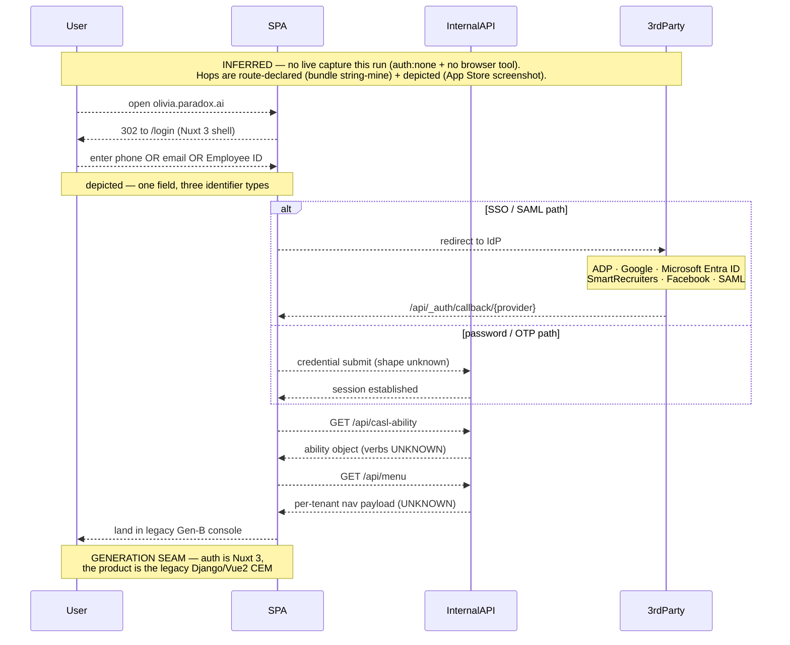
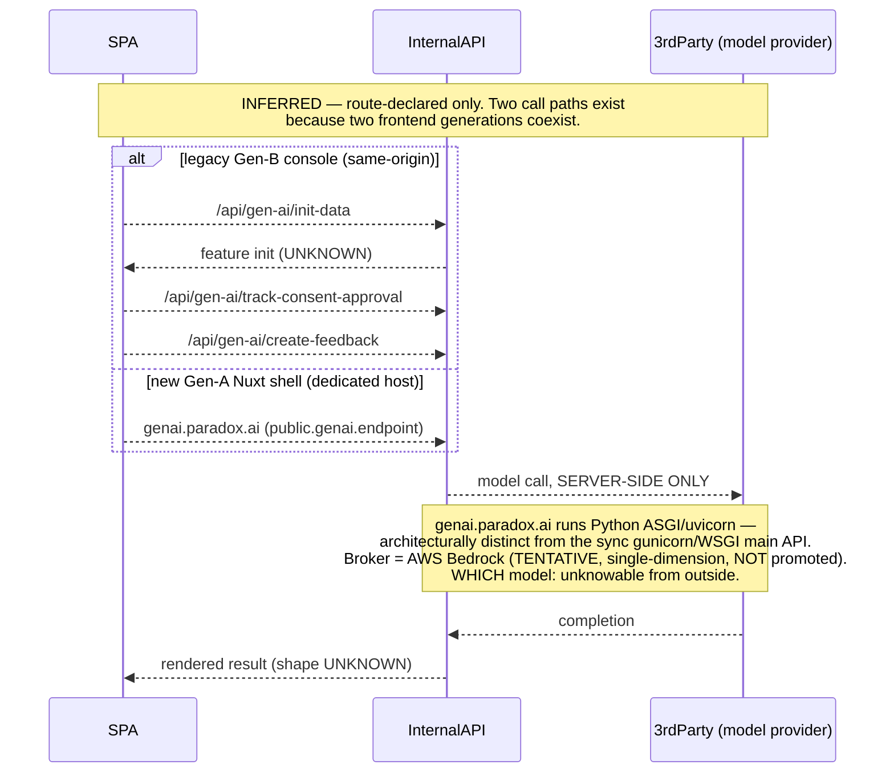
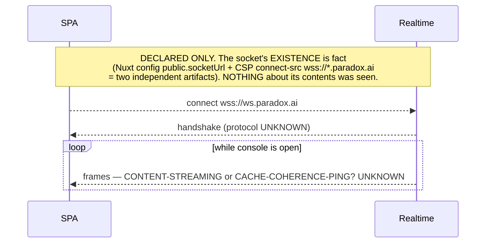
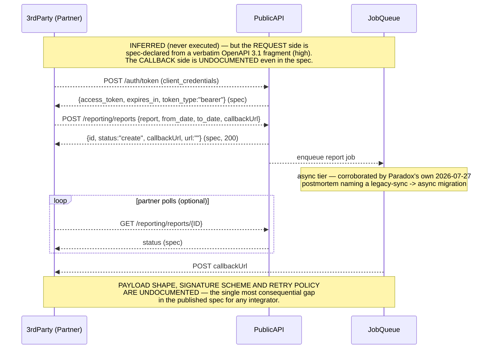
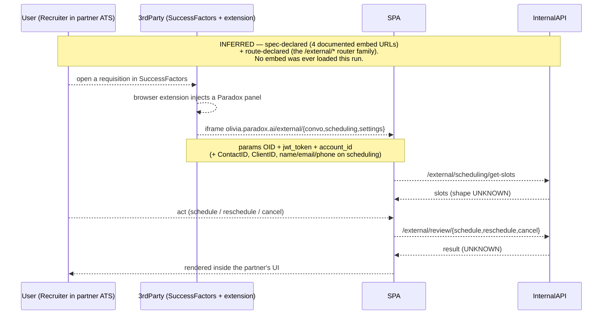

# Paradox — UX Flows

> ## ⚠️ READ FIRST — EVERY DIAGRAM BELOW IS **INFERRED**. ZERO WIRE WAS OBSERVED ON THIS RUN.
>
> `cartography-flows.md` requires flows to be traced from the **observed wire** captured by the
> `session` dimension. **This run captured none.** Two stacked blockers:
>
> 1. **`auth: none`** — `session` is `status: absent` (`completeness_pct: 0`, `write_side_observed: false`,
>    `pass2: not-applicable`), and `wire-capture` is `status: folded` into it. No in-page fetch/XHR tap
>    was ever installed; no request, response, frame, or status code was ever seen.
> 2. **The Chrome / browser-driving MCP tools were absent from this session entirely** (verified by tool
>    search — a *capability* gap, not a permission gate). Even a public-surface tap was not executable.
>
> **Consequence, applied without exception:** `cartography-flows.md` **diagram rule 6 (the write-side
> rule)** says a flow touching a write/generate/launch path on a `write_side_observed: false` run is
> drawn **as inferred** — dashed arrows plus an explicit `Note over … : inferred` — never as observed.
> On this run that rule does not apply to *some* flows; **it applies to all of them, on both the read and
> the write side.** Accordingly:
>
> - **Every arrow in every diagram below is dashed (`-->>`)**, including requests. A solid arrow would
>   assert observation, and there is none to assert.
> - **Every diagram carries a `Note over` naming its evidence class**, one of:
>   - `spec-declared` — the request/response shape comes from a served, machine-parseable OpenAPI 3.1
>     fragment (api · openapi-verbatim · **high**). Strong evidence *that the contract exists*; **no
>     evidence it was ever exercised**.
>   - `route-declared` — the hop comes from a client-side router path literal string-mined out of a JS
>     bundle (deployed-client-bundle · bundle-string-mine · **medium**). Evidence a route is *registered*.
>   - `depicted` — the UI step is visible in a first-party **App Store listing screenshot**
>     (distribution-artifacts · binary-extract · high) — a marketing image of the real product chrome,
>     **not a capture from this run**.
>   - `inferred` — reasoned from architecture, with no artifact naming the hop.
> - **No status codes, response bodies, latencies, or frame contents are shown anywhere**, because none
>   were seen. Where a spec documents response codes, they are labelled `(spec)`.
>
> **What this document is:** the best reconstruction of Paradox's primary journeys from a served partner
> spec, a string-mined router, and product screenshots. **What it is not:** a record of how the product
> behaves. Treat every diagram as a *hypothesis to be validated by one read-only Pass-1 session*, not as
> a finding.

---

## TL;DR — how the product gets work done (as far as static evidence can say)

Paradox's work happens on **three transports that barely touch each other**, and the run's most
important flow-level finding is that **the primary one has no capturable web wire at all**.

1. **The candidate side rides carrier channels, not HTTP.** The Statuspage's "Conversations" component
   group is literally **SMS · Site Widget · WhatsApp · Email · Facebook Messenger** (community:
   `raw/statuspage-components.json` · crawl-clip · medium), with **Twilio (incl. SendGrid)** named as the
   SMS/email sub-processor and **WhatsApp Business Platform (Meta)** onboarding config in the bundle. The
   candidate ↔ Olivia conversation — *the product* — therefore has **no client bundle and no browser wire
   to tap** (deployed-client-bundle: `_summary.md` Inferences · medium). Even a fully-authorised recruiter
   session would capture the **console's** wire, not the conversational one. This is a structural limit,
   not a run shortfall.
2. **The recruiter side is a legacy server-session console.** `olivia.paradox.ai` sets a `csrftoken`
   cookie with `Vary: Cookie` (the Django server-session signature) behind a Nuxt-auth layer — per
   `tradecraft.md`'s auth-token-location taxonomy, the **opaque session-cookie** case (no `Authorization`
   header, no JS-readable token). *Bundle-declared, never confirmed by the by-omission replay probe.*
3. **The partner side is a thin, deliberately-scoped sync API.** 53 operations, offset/limit envelope,
   a hand-rolled numeric error taxonomy (`{"errors":[{"code":1015,…}]}`), OAuth2 `client_credentials`
   with credentials issued by a **human team**. **Exactly one outbound webhook** (an async report
   `callbackUrl`) and **exactly one inbound contract** (`PUT /interview/interview_alerts`, which can
   create a Candidate that does not yet exist). **No generic event bus, no `/webhooks` CRUD, no signature
   docs** — an explicit, checked absence (api · high).
4. **Async is architecturally central and actively being extended.** The one documented outbound contract
   is a job+callback; and Paradox's own 2026-07-27 Statuspage postmortem discloses an active initiative
   converting **legacy synchronous endpoints to the platform's standard asynchronous model** after
   connection-pool exhaustion (community: `raw/issue-themes.md` · crawl-clip · medium).
5. **Realtime exists and is entirely opaque.** `wss://ws.paradox.ai` is declared in the Nuxt runtime
   config *and* allowed by the CSP `connect-src` — two independent artifacts, so **the socket's existence
   is fact**. Its protocol, frame format, and event catalogue are **completely unknown**. Per
   `tradecraft.md`'s realtime-trap rule the negative is recorded too: **no** Pusher / Ably / Socket.IO /
   Firestore host appears in the CSP, so this is a **first-party socket**, not a vendored realtime SaaS.
6. **The AI layer is server-brokered without exception.** The live CSP `connect-src` names **no
   third-party LLM host at all** — a direct observation of the allow-list, so *"no client-direct model
   call exists"* is **fact**. Which model sits behind `genai.paradox.ai` is unknowable from outside
   (Bedrock is the best-supported single-dimension inference, held tentative).
7. **The gate pattern is a human.** Partner API credentials come from the Paradox Integrations Team;
   Assistant Messaging and Next Step transitions are configured "on the backend by your CS
   Representative." Several flows below terminate at a **person**, not an endpoint.

---

## Flow index

| # | Flow | Category | Trigger | Participants | Complexity | Evidence class | Observed? |
| --- | --- | --- | --- | --- | --- | --- | --- |
| F1 | Recruiter login (two-generation seam) | Auth & session | user opens `olivia.paradox.ai` | User · SPA · InternalAPI · 3rdParty | moderate | route-declared + depicted | ❌ **inferred** |
| F2 | Candidate conversational apply → screen → schedule | Core action | QR / SMS keyword / Indeed Apply / career site | User · 3rdParty · InternalAPI · Store | **complex** | spec-declared + depicted + inferred | ❌ **inferred** |
| F3 | Recruiter triage → human takeover of the AI thread | Core action | open `/candidates/inbox` | User · SPA · InternalAPI · 3rdParty | moderate | depicted + route-declared | ❌ **inferred** |
| F4 | Console-driven interview scheduling | Core action | recruiter schedules from a candidate record | User · SPA · InternalAPI · 3rdParty | **complex** | route-declared + spec-declared | ❌ **inferred** |
| F5 | "Assist" recruiter copilot query (voice or text) | AI | tap the Assist button | User · SPA · InternalAPI · Realtime | moderate | depicted + route-declared | ❌ **inferred** |
| F6 | GenAI call path (the two-generation duplicate) | AI | any AI-assisted console feature | SPA · InternalAPI · 3rdParty | moderate | route-declared | ❌ **inferred** |
| F7 | Realtime channel lifecycle | Realtime | console load | SPA · Realtime | simple | declared-only | ❌ **contents entirely unknown** |
| F8 | Async report generation + callback | Data pipeline | `POST /reporting/reports` | PublicAPI · JobQueue · 3rdParty | moderate | **spec-declared (high)** | ❌ **inferred** |
| F9 | Inbound partner interview alert (create-if-absent) | Data pipeline | partner ATS pushes an interview request | 3rdParty · PublicAPI · InternalAPI | moderate | **spec-declared (high)** | ❌ **inferred** |
| F10 | Partner-embedded console (signed-URL iframe) | Configuration | recruiter opens Paradox inside SuccessFactors | User · 3rdParty · SPA · InternalAPI | moderate | spec-declared + route-declared | ❌ **inferred** |

**10 primary journeys identified · 10 diagrammed · 0 observed.** See the scoring note in
`feature-coverage.md`: `flow_coverage` is scored **0**, not 100, because an inferred diagram is a
hypothesis, not coverage.

**Participant vocabulary** (`cartography-flows.md`, held identical across every diagram):
`User` (recruiter *or* candidate — labelled per diagram) · `SPA` (the CEM console client) ·
`InternalAPI` (`api.paradox.ai` + same-origin `/api/*` — the app's own transport) ·
`PublicAPI` (`api.paradox.ai/api/v1/public` — the published partner API; used **only** where a flow
genuinely runs on it) · `JobQueue` (async report/worker tier) · `Realtime` (`wss://ws.paradox.ai`) ·
`3rdParty` (Twilio/SendGrid, Meta WhatsApp, Workday/SAP/Indeed, Zenoti, Textkernel) ·
`Store` (client cache — **speculative on this target; no client state was ever inspected**).

---

## Auth & session flows

### F1 — Recruiter login (and the two-generation seam)

**Trigger:** user opens `olivia.paradox.ai` · **Surface:** `/login` (Gen-A Nuxt shell) ·
**Observed?** ❌ **inferred** (route-declared + depicted)



**Notes.**
- The **generation seam** is the flow's most distinctive property: the user authenticates on the new
  stack and lands on the old one. Rewriting *auth first* is the highest-leverage strangler-fig entry
  point in the run.
- **Transport model is bundle-declared, not probed.** `csrftoken` + `Vary: Cookie` + no `Authorization`
  header anywhere in the unauth shell puts this in `tradecraft.md`'s **opaque session-cookie** class.
  The by-omission replay probe (§9.4) that would *confirm* it was never run.
- `/api/casl-ability` and `/api/menu` are the two calls that would convert most of
  `information-architecture.md`'s `Dn (inferred)` labels into measured depths. **Neither was ever made.**
- The `smartrecruiters` SSO callback is notable in itself: a competing ATS federating recruiter identity
  into Paradox.
- **Unknown:** OTP vs password, MFA, session lifetime, refresh path, whether `/candidate` is a distinct
  candidate-side auth surface.

---

## Core action flows

### F2 — Candidate: conversational apply → screen → schedule → offer

**Trigger:** QR code scan · SMS keyword · Indeed Apply · a Paradox career site ·
**Surface:** the candidate's own messaging app (**not a Paradox UI**) ·
**Observed?** ❌ **inferred — and structurally unobservable by this harness**

```mermaid
sequenceDiagram
    participant User as User (Candidate)
    participant 3rdParty as 3rdParty (Twilio/Meta)
    participant InternalAPI
    participant Store as Store (Knowledge Base)
    Note over User,Store: INFERRED — no live capture this run.<br/>NOTE: this flow rides CARRIER SMS/WhatsApp/Messenger —<br/>it has NO web client bundle and NO browser wire to tap, EVER.
    User-->>3rdParty: text keyword / scan QR / tap Indeed Apply
    3rdParty-->>InternalAPI: inbound message webhook
    InternalAPI-->>3rdParty: Olivia opener
    3rdParty-->>User: "Hi, I'm Olivia, your personal job assistant"
    Note over User,3rdParty: depicted — verbatim opener in the App Store transcript
    loop screening turns (count + branching UNKNOWN)
        User-->>3rdParty: answer OR ask a question
        3rdParty-->>InternalAPI: message
        alt candidate ASKED a question
            Note over InternalAPI: "Inquiry Detection" — intent classification<br/>(named in the KB glossary; behaviour unobserved)
            InternalAPI-->>Store: look up tenant Knowledge Base
            Store-->>InternalAPI: answer + employer-page link
        else candidate ANSWERED a screening question
            InternalAPI-->>InternalAPI: evaluate vs job requirements
        end
        3rdParty-->>User: reply
    end
    opt qualified
        InternalAPI-->>3rdParty: propose 2 concrete slots + oli.vi short link
        3rdParty-->>User: slot proposal
        Note over User,3rdParty: depicted — oli.vi/&lt;token&gt; "view more times"
        User-->>3rdParty: pick a slot
        InternalAPI-->>InternalAPI: create Interview, set candidate_journey_status
    end
    opt hired
        InternalAPI-->>3rdParty: offer_letter delivered in-thread
        InternalAPI-->>3rdParty: onboarding (I-9, WOTC, tax forms)
        Note over InternalAPI,3rdParty: Symmetry Software = embedded-tax-forms sub-processor
    end
```

**Notes.**
- **This is the product, and it is the least-evidenced flow in the corpus.** Only its *endpoints* are
  evidenced: the channel list (Statuspage components), the Candidate schema (`offer_letter`,
  `candidate_journey_status`, `language_preference` with **57 locale codes**), the `oli.vi` short link
  (screenshot + independently resolved live, 308 → `olivia.paradox.ai`, `noindex,nofollow`), and the
  transcript screenshot. **Everything between the turns is inference.**
- **Unobserved and therefore unclaimed:** the conversation content model, branching logic, the
  escalation-to-human threshold, latency, containment rate, how the Bedrock-brokered model is prompted
  and grounded against the tenant Knowledge Base, and how a hostile or ambiguous reply is handled. The
  marketing figures *"automate up to 90–100% of the hiring process"* and *"one third of interactions
  happen outside business hours"* are **behaviour claims about this unobserved flow** and stay tentative
  (`product-features.md` §10).
- **`Store` here means the tenant Knowledge Base** (`/settings/knowledge-base`), not a client cache — no
  client state was inspected on this run.
- **The structural finding:** closing this gap needs *a live phone*, not a session. A recruiter login
  would capture the console's wire, not this one.

### F3 — Recruiter: triage → open a candidate → take over the AI thread

**Trigger:** recruiter opens the candidate inbox · **Surface:** `/candidates/inbox` → candidate profile →
Conversation tab · **Observed?** ❌ **inferred** (depicted + route-declared)

```mermaid
sequenceDiagram
    participant User as User (Recruiter)
    participant SPA
    participant InternalAPI
    participant 3rdParty as 3rdParty (Twilio/Meta)
    Note over User,3rdParty: INFERRED — no live capture this run.<br/>UI steps are depicted (App Store screenshots);<br/>routes are string-mined; NO endpoint was ever observed.
    User-->>SPA: open /candidates/inbox
    SPA-->>InternalAPI: list candidates (endpoint UNKNOWN)
    InternalAPI-->>SPA: rows + status pills + counts
    Note over SPA,User: depicted — Interview Scheduled / Pending /<br/>Canceled / "Capture Incomplete"; sort by recent activity
    User-->>SPA: open one candidate
    SPA-->>InternalAPI: fetch profile (endpoint UNKNOWN)
    InternalAPI-->>SPA: Conversation / Resume / Notes / Hire Details
    Note over SPA,User: depicted — 4 tabs; plus a view/read-receipt audit trail
    opt human takeover (a WRITE — never observed)
        User-->>SPA: type into "Write a reply…"
        Note over SPA: composer retargets to the candidate's channel<br/>(read "Send an email", not "send a message")
        SPA-->>InternalAPI: send message (endpoint UNKNOWN)
        InternalAPI-->>3rdParty: deliver on SMS / email / WhatsApp / Messenger
        3rdParty-->>User: delivery (confirmation shape UNKNOWN)
    end
```

**Notes.**
- The takeover step is a **write on a `write_side_observed: false` run** — dashed and inferred per
  diagram rule 6. The published API's `POST /candidates/send_message` is the nearest *documented*
  analogue, but the published surface is **near-disjoint** from the app's own
  (`data-model-api-surface.md`), so it is **not** asserted as the console's call.
- The **channel-retargeting composer** is the most interesting depicted detail: one composer, N
  transports, resolved server-side per candidate.
- **Unknown:** pagination, filter/segment semantics (`/list-filters`), whether takeover pauses the AI or
  runs alongside it, and whether the inbox updates over `wss://ws.paradox.ai` or by polling.

### F4 — Console-driven interview scheduling

**Trigger:** recruiter schedules/reschedules from a candidate or interview record ·
**Surface:** `/lead-interview/*`, `/interviews`, `/my-calendar` · **Observed?** ❌ **inferred**

```mermaid
sequenceDiagram
    participant User as User (Recruiter)
    participant SPA
    participant InternalAPI
    participant 3rdParty as 3rdParty (calendar/Zenoti)
    Note over User,3rdParty: INFERRED — route-declared only (~40 scheduling routes<br/>string-mined from the bundle). No call was ever observed.
    User-->>SPA: choose Schedule on a candidate
    SPA-->>InternalAPI: /lead-interview/slots
    InternalAPI-->>3rdParty: calendar + room availability
    Note over InternalAPI,3rdParty: OIT (Open Interview Times) = interviewer availability;<br/>Zenoti strings (ROOM_BOOKING_TYPE, MAX_ITV_DURATION_ZENOTI)<br/>indicate a room/service booking backend
    3rdParty-->>InternalAPI: free/busy + rooms
    InternalAPI-->>SPA: candidate slot set
    opt round-robin assignment
        InternalAPI-->>InternalAPI: /settings/round-robin-management policy
    end
    User-->>SPA: confirm (a WRITE — never observed)
    SPA-->>InternalAPI: /lead-interview/schedule
    InternalAPI-->>3rdParty: notify candidate on their channel
    alt panel / group / sequential / multi-day
        Note over InternalAPI: interview_type enum has 18 values incl.<br/>GROUP_SESSION, INTERVIEW_PREFERENCE, BREAK (spec)
        InternalAPI-->>InternalAPI: interview_segments, sequential_order_automation
    else single interview
        InternalAPI-->>InternalAPI: single Interview record
    end
    opt reschedule / cancel later
        User-->>SPA: /lead-interview/{reschedule,cancel,cancel_request}
        SPA-->>InternalAPI: state transition (shape UNKNOWN)
    end
```

**Notes.**
- **~40 of the 100+ router paths are in this cluster** — by route count, scheduling *is* the product.
- The richest **spec-declared** artifact in the corpus describes the *inbound partner* version of this
  flow, not the console version: `PUT /interview/interview_alerts`, 48 fields, an 18-value
  `interview_type` enum, `interview_segments`, `alternate_interview_team`, `generate_virtual_url`,
  `debrief`, `force_sequent_multi_days` (api · openapi-verbatim · high). The console flow is assumed to
  hit the same domain model — **assumed, not shown**.
- **Zenoti** (spa/salon booking software) appearing as the room-booking backend is a genuinely
  surprising, single-source (bundle) detail worth validating first in any future session.

---

## AI flows

### F5 — "Assist": the recruiter-facing copilot

**Trigger:** recruiter taps the **Assist** button in the console header ·
**Surface:** `/assist`, `/assist/calendar`, `/assist/scheduling_action` ·
**Observed?** ❌ **inferred** (depicted + route-declared → the *feature* is fact; the *flow* is not)

```mermaid
sequenceDiagram
    participant User as User (Recruiter)
    participant SPA
    participant InternalAPI
    participant Realtime
    Note over User,Realtime: INFERRED — no live capture this run.<br/>The FEATURE is fact (screenshot + router, 2 independent dims);<br/>every hop below is a hypothesis.
    User-->>SPA: tap Assist in the header
    SPA-->>User: right panel opens, console dimmed
    Note over SPA,User: depicted — "Hi &lt;name&gt;! How can I help?" +<br/>3 prompt chips + a large microphone + keyboard toggle
    alt voice input
        User-->>SPA: speak
        Note over SPA: ASR location UNKNOWN — client, InternalAPI, or a vendor
        SPA-->>InternalAPI: audio or transcript (UNKNOWN)
    else typed input
        User-->>SPA: "When is my next interview?"
        SPA-->>InternalAPI: /assist request (shape UNKNOWN)
    end
    InternalAPI-->>InternalAPI: route to genai.paradox.ai (server-side)
    Note over InternalAPI: server-brokered without exception — the CSP connect-src<br/>names NO third-party LLM host (direct observation = fact)
    opt tool-style action
        InternalAPI-->>InternalAPI: /assist/scheduling_action, /assist/calendar
    end
    alt streamed over the socket
        InternalAPI-->>Realtime: publish
        Realtime-->>SPA: frames (format UNKNOWN)
    else plain HTTP response
        InternalAPI-->>SPA: response (shape UNKNOWN)
    end
    SPA-->>User: answer in the panel
```

**Notes.**
- **The most strategically interesting finding in the run rests on exactly two artifacts** — one App
  Store screenshot and three router path literals. Its *existence* is fact (two independent dimensions);
  its request shape, its model, whether it can *act* or only answer, and whether it streams over
  `wss://ws.paradox.ai` are **all unknown**.
- The `/assist/scheduling_action` path name is the strongest hint that Assist **takes actions**, not just
  answers — but a route literal is not a tool schema.
- Assist appears in **no** product page, **no** KB article, and **none** of the 53 public API operations.

### F6 — The GenAI call path (and its two-generation duplicate)

**Trigger:** any AI-assisted console feature · **Observed?** ❌ **inferred** (route-declared)



**Notes.**
- **Two integration points to one capability** is a real duplicate-surface finding attributable to the
  in-flight rewrite — **not** a dormant route.
- A **consent-tracking** endpoint (`track-consent-approval`) as a first-class GenAI path is a notable
  compliance-by-design tell for an HR-tech product.
- `create-feedback` implies a thumbs-up/down loop on AI output — an evaluation surface, unmarketed.
- **The public API exposes no AI/generation operation whatsoever.** Partners get none of this.

---

## Realtime flows

### F7 — The realtime channel: existence is fact, contents are unknown

**Trigger:** console load · **Observed?** ❌ **contents entirely unobserved**



**Notes.**
- Per `tradecraft.md`'s **multi-channel-realtime trap**, the negatives are recorded as findings: **no**
  Pusher, Ably, Socket.IO, Centrifugo, Phoenix or Firestore host appears in the CSP — this is a
  **first-party socket**. And no SSE/long-poll signal was found either.
- The single most valuable unanswered question: **content-streaming vs cache-coherence-ping.** If frames
  carry only `{id, event}` metadata and the SPA refetches REST, the architecture is one thing; if they
  carry conversation deltas, it is another. **A future run must install the WebSocket constructor wrapper
  BEFORE navigation** (`tradecraft.md` tap 2 + the on-load-socket caveat: client-side-nav to mount a
  fresh socket through the wrapper), and must fingerprint any binary frame by **byte-length + first 16
  bytes as hex AND ASCII** rather than logging `[binary]`.
- Whether **Assist** (F5) rides this socket is an open question in `data-model-api-surface.md`.

---

## Data pipeline flows

### F8 — Async report generation + the one outbound webhook

**Trigger:** `POST /reporting/reports` · **Observed?** ❌ **inferred — but spec-declared at high confidence**



**Notes.**
- This is **the entire outbound event surface of the product.** There is **no generic webhook
  subscription system, no event-type catalogue, and no signature-verification documentation** anywhere
  in the 55-page portal — an explicit, checked absence (api: `_summary.md` gaps · high). For a product
  whose value proposition is event-driven candidate progression, partners **poll or receive nothing**.

### F9 — Inbound partner interview alert (create-if-absent)

**Trigger:** a partner ATS pushes an interview request into Paradox ·
**Observed?** ❌ **inferred — spec-declared at high confidence**

```mermaid
sequenceDiagram
    participant 3rdParty as 3rdParty (Partner ATS)
    participant PublicAPI
    participant InternalAPI
    Note over 3rdParty,InternalAPI: INFERRED (never executed) — request schema is<br/>spec-declared verbatim (48 fields, 18-value enum). High confidence<br/>that the CONTRACT exists; zero evidence it was exercised.
    3rdParty-->>PublicAPI: PUT /interview/interview_alerts
    Note over 3rdParty,PublicAPI: identity by OID, ex_id, OR job_application_id<br/>(use_application_id_for_identity)
    alt candidate does NOT exist in Paradox
        PublicAPI-->>InternalAPI: CREATE the Candidate
        Note over PublicAPI,InternalAPI: documented verbatim: "will create Candidates<br/>within Paradox that do not exist"
    else candidate exists
        PublicAPI-->>InternalAPI: resolve by external key
    end
    opt validation toggle enabled
        Note over PublicAPI: Settings > Client Setup > Integrations ><br/>"Enable Validation for Interview Alerts Scheduling"<br/>(doc updated 2026-07-24 — actively developed)
        PublicAPI-->>3rdParty: 400 + {"errors":[{"code":NNNN,...}]} (spec)
    end
    PublicAPI-->>InternalAPI: apply action interview / cancel / reschedule
    InternalAPI-->>3rdParty: 200 (spec)
```

**Notes.**
- **A write endpoint that creates entities as a side effect of scheduling** is the sharpest expression of
  the "mirror someone else's system of record" design: the partner's ATS is authoritative, and Paradox
  materialises whatever it is told about.
- An **opt-in** validation toggle (default off) means the contract historically accepted whatever it was
  handed — a real integration-robustness signal.
- The three **flagship partners use three genuinely different mechanisms**: Workday = server-to-server
  status sync · SAP SuccessFactors = a **client-side browser extension** injecting Paradox UI through the
  iframe contract · Indeed = the application completes **inside Indeed Apply itself**. This is bespoke
  integration engineering per partner, not one uniform overlay (api: `raw/partner-integrations.md` · high
  + website · medium → **fact**).

---

## Configuration flows

### F10 — Partner-embedded console (signed-URL iframe)

**Trigger:** a recruiter opens Paradox from inside SAP SuccessFactors · **Observed?** ❌ **inferred**



**Notes.**
- **This is an IA finding as much as a flow finding:** for a SuccessFactors recruiter, Paradox has **no
  navigation at all** — it is a panel inside somebody else's console.
- **What mints `jwt_token` is unknown.** None of the 53 published operations returns one. The published
  sample is HS256 with a 2018-dated placeholder payload, implying shared-secret signing, plausibly
  per-account — **doc-sample-derived, not confirmed** (`data-model-api-surface.md` open question #2).
- The same in-partner-UI pattern reappears as the **Olivia Extension** injecting a Paradox panel over
  LinkedIn's messaging UI — a third, independent corroboration of the embed strategy.

---

## Cross-dimension reconciliation — the flow as the app runs it vs as the docs describe it

**The diff that normally lives here cannot be computed on this run, and that is the finding.**
`cartography-flows.md` asks for the published-vs-observed drift, with *published = fact,
observed-drift = tentative*. There is **no observed lane**. What can be said:

| Aspect | Published lane (`api` · openapi-verbatim · **high**) | App-own lane (`bundle` · bundle-string-mine · **medium**) | Verdict |
| --- | --- | --- | --- |
| Path space | 53 ops / 36 paths, all under `/api/v1/public/*` | 100+ router paths + `/api/{_auth,casl-ability,company,menu,gen-ai/*}` | **near-disjoint — effectively zero overlap.** The partner API is a bolt-on, not the product's transport. |
| AI | **zero** AI/generation operations | `/api/gen-ai/*` + `genai.paradox.ai` | the headline capability is entirely unavailable to partners |
| Realtime | absent | `wss://ws.paradox.ai` | partners get no realtime |
| Auth | OAuth2 `client_credentials` / HTTP Basic, human-issued | Django server-session + 5 SSO providers + SAML | **two entirely separate auth systems** |
| Events | 1 outbound (report callback), 1 inbound (interview alerts) | unknown | no event bus on either side |
| Drift | — | — | **unmeasurable — no observed lane exists** |

**Which declared paths are actually exercised is unresolved and is named as such everywhere**, in this
document and in `data-model-api-surface.md`. **No dormant-route claim is made anywhere.**

---

## Open questions

1. **What does the candidate conversation actually look like as a wire?** Almost certainly nothing
   capturable in a browser — closing this needs a live phone texting a Paradox-powered career site, not a
   session.
2. **Content-streaming or cache-coherence-ping on `wss://ws.paradox.ai`?** And does Assist ride it?
3. **What is the Assist request shape** — a prompt, a tool-call schema, or an intent classifier? Can it
   *act* (`/assist/scheduling_action` suggests yes) or only answer?
4. **What does the report `callbackUrl` deliver** — payload, signature, retry policy? Undocumented on the
   only page that documents the request side.
5. **What mints the iframe `jwt_token`?** Claims, expiry, key scope all unknown.
6. **Does the console call the published operations at all**, or does it run entirely on its own
   same-origin surface? One pre-navigation in-page tap answers this.
7. **Which foundation model does `genai.paradox.ai` front?** Bedrock is the best-supported inference
   (single-dimension, tentative, deliberately not promoted); the model itself is undisclosed and
   unobservable from outside.
8. **Where is ASR performed for Assist's voice input** — in the browser, at `genai.paradox.ai`, or at a
   vendor? No speech vendor appears in the sub-processor list or the CSP, which is itself a small
   negative finding worth re-checking.
9. **Does human takeover pause the AI?** A product-defining detail with zero evidence either way.
