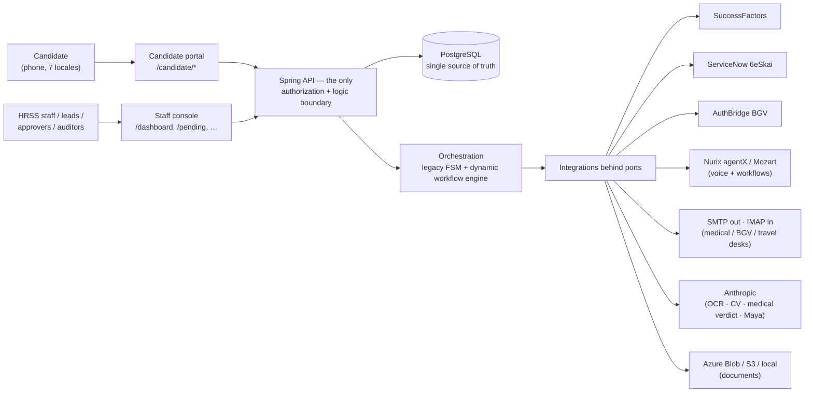
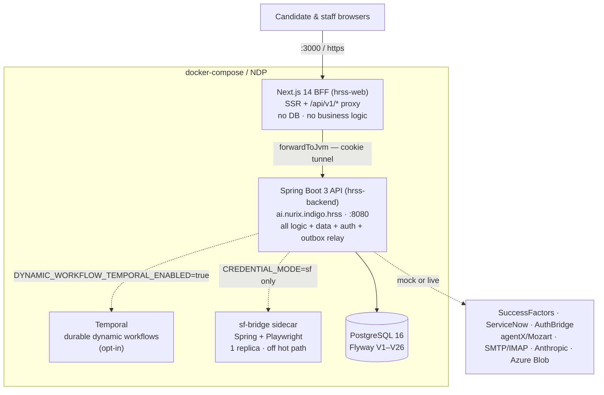
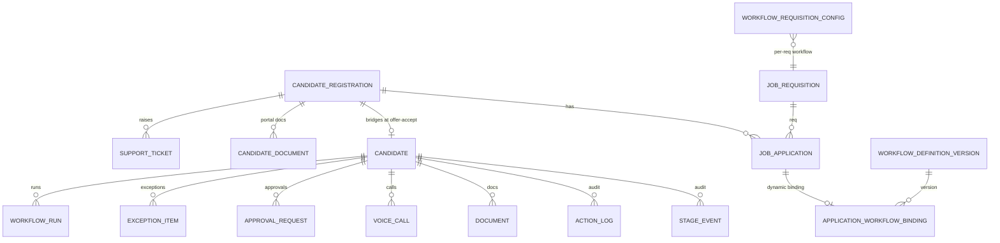

# IndiGo HRSS — Solution Documentation

**Engagement:** Nurix Labs → IndiGo. Hire-to-induction automation for Airport Operations & Customer
Services (AO&CS) HR shared services.
**Public origin:** `https://indigo.nustack.tech` (NDP / Azure).
**Written against:** `nurixlabs/indigo_hrss`, branch `fix/prejoining-batch-2026-09-01` (`a4274fc`),
verified against the code on **2026-09-02**.

**What this document is.** The single solutioning document: the business problem, the solution we
built, every integration contract, the orchestration model, the security and data design, the
deployment posture, the operational runbook, and an honest register of what is *not* done. It is
written to be read end-to-end by someone with no prior context, and to be usable as the reference in a
design review or a handover.

**How it relates to the other documents.**

| Document | Owns |
|---|---|
| **this file** | The whole solution, current, in one place — the entry point |
| [prd.md](prd.md) | Product requirements: FR-A…FR-M, success metrics, open product decisions |
| [architecture.md](architecture.md) | HLD/LLD narrative + the scale-out target (⚠️ last reviewed 2026-08-04: says Flyway V1–V7 and 12 modules; **superseded by §11/§12 here**) |
| [dynamic-workflow-orchestrator-plan.md](dynamic-workflow-orchestrator-plan.md) | The design brief for the versioned workflow engine (§8) |
| [servicenow-6eskai-integration.md](servicenow-6eskai-integration.md) · [ENHC0010027-uat-summary.md](ENHC0010027-uat-summary.md) | ServiceNow API contract + UAT evidence |
| [env-migration.md](env-migration.md) | Per-variable Railway → NDP env/secret migration |
| [pilot-vs-prod-gap-audit.md](pilot-vs-prod-gap-audit.md) · [frontend-port-scope.md](frontend-port-scope.md) | Pilot→prod feature gap analysis |
| [SDK-EXTRACTION-PLAN.md](SDK-EXTRACTION-PLAN.md) | Plan to extract each integration module as a standalone SDK (0/11 steps done) |

**Status legend, used throughout:** ✅ built & verified · 🟡 partial, with a named gap · 🔩 stub (code
exists, throws or no-ops) · ⬜ not started · ❓ open decision.

---

## Table of contents

1. [Executive summary](#1-executive-summary)
2. [Business context & problem](#2-business-context--problem)
3. [Solution overview & principles](#3-solution-overview--principles)
4. [Scope](#4-scope)
5. [Users, roles & principals](#5-users-roles--principals)
6. [Domain model & vocabulary](#6-domain-model--vocabulary)
7. [The candidate journey: stages, tracks, gates](#7-the-candidate-journey-stages-tracks-gates)
8. [Workflow orchestration — two engines](#8-workflow-orchestration--two-engines)
9. [AI & agent layer](#9-ai--agent-layer)
10. [Integration solutioning](#10-integration-solutioning)
11. [Solution architecture](#11-solution-architecture)
12. [Data solution](#12-data-solution)
13. [Security & compliance](#13-security--compliance)
14. [Non-functional requirements & capacity](#14-non-functional-requirements--capacity)
15. [Environments, configuration & deployment](#15-environments-configuration--deployment)
16. [Operations runbook](#16-operations-runbook)
17. [Quality & test strategy](#17-quality--test-strategy)
18. [Risk, gap & dependency register](#18-risk-gap--dependency-register)
19. [Roadmap & build order](#19-roadmap--build-order)
20. [Appendices](#20-appendices)

---

## 1. Executive summary

IndiGo's AO&CS team hires at volume into airside and ground roles across Indian stations. The leg from
*"this person was selected"* to *"this person walked into induction"* spans six systems and four desks,
and every hand-off is a mail, a call or a spreadsheet. The failure mode is **not error — it is
silence**: an offer nobody answered, a medical that cleared and then nothing, a flight booked from a
city the candidate never named.

The solution is a **single console that owns the state machine** for that leg. It keeps SuccessFactors
as the coarse recruiting system of record, drives the medical partner, the BGV vendor and the
ServiceNow travel/hotel desks itself, chases the candidate automatically by mail and by AI voice agent,
and exposes every outstanding item to HRSS in exactly one queue with an age on it.

**Shape of the build.** A thin Next.js BFF (pure UI + proxy, no database, no business logic) over a
**13-module Spring Boot 3 / Java 21 backend** (ports & adapters) that owns all logic, data and
integrations, on a single backend-owned PostgreSQL. Every external system sits behind a port with a
mock implementation, so **going live is an environment flip, not a code change**, and the resolved mode
of every adapter is observable on an endpoint.

**Where it stands.** In UAT hardening with live vendor adapters written for every integration
(SuccessFactors OData, ServiceNow 6eSkai, AuthBridge BGV, Nurix agentX voice + Mozart workflows,
Anthropic OCR/LLM, SMTP out / IMAP in, Azure Blob storage, Entra SSO). The journey runs end-to-end on
mocks with no credentials at all. Two orchestration engines coexist: the shipped **legacy FSM**
(11 stages × 10 parallel tracks) and a **versioned YAML/Temporal workflow engine** (`aocs-hire` v5/v6/v7)
that is per-application opt-in.

**The three things that decide go-live** (detail in §18): the capacity gate has never been run at
target concurrency; ServiceNow's only working OAuth grant is a ~100-day `refresh_token`; and one
Mozart/agent configuration axis in production is still unverified per environment.

---

## 2. Business context & problem

### 2.1 The systems this sits between

| System | Role in the hire | Owner |
|---|---|---|
| **SuccessFactors (SF)** | Recruiting system of record: requisitions, candidate accounts, the offer letter, coarse application status | IndiGo HR IT |
| **Medical partner** | Pre-employment medical; verdicts arrive as mail replies with a colour, plus report attachments | Third party |
| **AuthBridge** | Background verification (education-first), case-based, verdict pulled by API | Vendor |
| **ServiceNow (6eSkai HR)** | Travel desk, accommodation desk, HR-tech case management | IndiGo |
| **Nurix agentX / Mozart** | Outbound AI voice agents and workflow orchestration | Nurix |
| **The candidate** | Has a phone, may not read English comfortably, may go quiet | — |

### 2.2 The incidents the design defends against

Each row is a real failure the product now has a specific control for. (Source: [prd.md §1](prd.md).)

| What happened | Cost | Control in this solution |
|---|---|---|
| An experienced hire was given a joining date and booked onto a flight while BGV was still open | A hire that can be revoked after money is spent | **G-PREONB** AND-gate: medical always, BGV for experienced hires, before any DOJ (§7.3) |
| A candidate whose medical cleared uploaded nothing and simply stopped; found when a record had not moved in a fortnight | Two weeks lost, invisible | Pre-joining document sweep + voice chase + one queue with an age (§9.1, §16.1) |
| A mis-transcribed starting location ("USA") went straight out as a booking request | A real ticket from a city the candidate never named | **G-TRAVEL**: origin parks at `location_review` until a human confirms (§7.3) |
| A catering role's physical was booked as an afterthought | A second appointment, a second trip, a week on the DOJ | Medical initiated at offer-accept as part of pre-joining release (§7.2) |
| A travel request timed off the joining date, not the first itinerary stop | The induction three weeks earlier is the flight that has to exist | Itinerary model: travel counts back from the **first** hop (§6.3) |
| An offer nobody answered sat in no queue | Weeks of silence | Offer-accept reminder poller + offer-reminder voice agent (§16.1) |

### 2.3 Why the product is shaped as two audiences

HRSS staff need an operator cockpit measured in **dozens** of users. Candidates need self-service
measured in **thousands**. They share almost no screens and no session mechanism. That split is the
most load-bearing decision in the product: it is why the candidate portal is the multilingual,
scale-sized, mobile-first surface and the staff console is an English desktop console, and why the two
have separate authentication schemes (§13.1).

---

## 3. Solution overview & principles

### 3.1 What the platform does



### 3.2 Solution principles

1. **Light frontend, heavy backend.** Next.js holds no DB connection and no domain logic — it renders
   DTOs and proxies. Every decision, aggregation and decryption happens in Java.
2. **One data layer, backend-owned.** The Spring app owns the only database. Nothing else writes it.
3. **One authorization boundary.** RBAC is enforced server-side on every `/api/v1/**` call; the
   frontend's role checks are presentational only.
4. **Ports & adapters.** Every external system sits behind a `core` port with `@ConditionalOnProperty`
   mock/live implementations. No vendor SDK leaks into business code — enforced by an ArchUnit
   `ModuleBoundaryTest` that fails the build.
5. **Going live is configuration.** Mode flips are environment variables, and the *resolved* mode of
   every adapter is published on `/api/_actuator/info` — because "the env var is set" and "the vendor
   accepts us" are different facts.
6. **Slow or at-least-once work is durable.** State-changing side effects go through a transactional
   outbox, so a crash after commit replays instead of dropping.
7. **Automation never auto-rejects.** Every automatic path either advances a candidate or routes them
   to a human queue. Rejection is a human act.
8. **Fail loud over fail plausible.** A missing voice-agent id fails the call naming the variable
   rather than falling back to another agent — a silent fallback produces a working call reading the
   *wrong script*.

---

## 4. Scope

### 4.1 In scope ✅

- Candidate acquisition: per-requisition careers catalog, QR / deep-link entry, bulk registration mail.
- Candidate self-service portal: registration, one-time application capture (with CV autofill),
  document upload and re-upload, offer accept/decline/counter, DOJ confirm/reschedule, starting-location
  capture, itinerary view, voice-call history, support tickets, **Ask Maya** assistant, 7-language
  switcher (en/hi enabled).
- HRSS staff console: dashboard KPIs, one unified pending-action queue, candidate list + action
  console, application review, offer queue, medical verification, BGV decisions, joining-date
  allocation, travel/hotel confirmation, non-responsive chase, offers-declined re-offer, requisition
  CRUD, analytics, workflow viewer/editor.
- Orchestration: stage machine + parallel tracks, gates, the versioned dynamic workflow engine.
- Automation: mail out/in, AI voice chases, OCR document verification, CV extraction, medical-report
  classification, pollers for every wait in the journey.
- Integrations: SuccessFactors, ServiceNow, AuthBridge, Nurix agentX/Mozart, Anthropic, SMTP/IMAP,
  object storage, Entra SSO, SF headless credential bridge.
- Security: two session schemes, RBAC matrix, AES-256-GCM PII at rest, append-only audit.

### 4.2 Explicitly out of scope

- **Owning the offer letter.** The letter is built, versioned and extended inside SuccessFactors; the
  portal renders the rendered PDF and captures the response.
- **Staff-console scale.** Dozens of concurrent staff by design.
- **Concurrent voice-call capacity.** A Nurix/carrier capacity concern.
- **Live SF via headless Chrome on the candidate hot path.** The sidecar is single-replica, deliberately
  off the hot path.
- **Cross-region DR.** Single-region Multi-AZ is the target.
- **Deep i18n of the staff console.** English by design.
- **Reporting individual post-`pre_joining` steps to SF.** Medical, BGV, travel, joining and induction
  stay inside Nurix (§10.1).

---

## 5. Users, roles & principals

### 5.1 Human roles

| Role | Who | Signs in with | May do |
|---|---|---|---|
| `candidate` | Applicants | SF credentials, relayed (§10.8) | Everything on their own record: application, documents, offer response, DOJ, location, tickets, Maya |
| `hrss_agent` | Desk agents | Entra SSO (primary) or password | Review applications, approve offers, release pre-joining, verify medicals, decide BGVs, confirm travel origins, allocate DOJ, chase non-responders |
| `hrss_lead` | Team leads | Entra SSO or password | Agent powers **plus** the irreversible ones: remove from process, resolve exceptions, requisition CRUD, reassign/archive, trigger workflows, send the digest |
| `approver` | HR Leader / TA Leader / C&B / Ethics & Compliance | Entra SSO or password | Decide approvals routed to their kind, in a queue outside the HRSS shell. ⬜ **Nothing in production currently creates an approval** ([prd.md §11 D5](prd.md)) |
| `auditor` | Compliance | Entra SSO or password | Read-only everywhere — **including decrypted PII and ID document images** |

`Role` and `ApproverKind` are backend enums; the frontend imports labels only.

### 5.2 Non-human principals

| Principal | Gate | Trust posture |
|---|---|---|
| **Internal automation** — `/api/v1/internal/**` | shared `X-Internal-Token` header | Fails **closed** — a blank token rejects everything |
| **Agent-platform webhooks** — `/api/v1/webhooks/nurix/**` | `x-nurix-webhook-secret` | Fails **open** — an unset secret skips the check. ❓ Reconcile with the above before production traffic (§18) |
| **Outbox relay / pollers** | in-process, no HTTP principal | Runs as the application; every write is attributed in `ActionLog` |

---

## 6. Domain model & vocabulary

Four nouns, kept strictly distinct. Getting these wrong makes every requirement ambiguous.

| Term | Is | Key |
|---|---|---|
| **`JobRequisition`** | The **job** — a public careers-catalog posting | `req_id`, the public join key carried by careers links and QR codes |
| **`CandidateRegistration`** | The **person** on the portal: encrypted profile, SF push state, and a candidate-level mirror of their journey | email |
| **`JobApplication`** | This **person applied to that job**. Offer, medical, BGV, travel and joining date live here, because one person can hold two | id; soft string ref to `req_id` |
| **`Candidate`** | The internal **pipeline row** HRSS works: one global `Stage` plus ten parallel `Track` sub-states | id |

### 6.1 Three structural facts that shape everything

1. **The `Candidate` row is minted at offer-accept, not at registration.** A person can exist in the
   portal for weeks with no `Candidate` row — so before acceptance there is no stage, no exception queue
   and no audit feed for them. Consequence: the `DOC` and `OFFER` tracks are effectively vestigial in
   production, and the analytics funnel measures the *post-acceptance* pipeline.
2. **The same journey state can live in up to three places** — `JobApplication` (the truth, per job),
   `CandidateRegistration` (the mirror the portal reads), and the `Candidate` track (what the
   orchestrator gates on). Their vocabularies are **not identical**: travel is
   `none|scheduled|triggered|booked|extended` on the application but
   `pending|not_needed|requested|booked|confirmed` on the track. `MedicalBgvTrackMapping` is the
   translation layer; writing only one copy is the "split-brain" class of defect that stranded
   candidates historically.
3. **One joining date is really an itinerary.** A joiner may attend induction in one city, training in
   another, and only then join. Hops are `induction | training | joining`; only the joining hop is
   mandatory and it must be last. **Travel timing counts back from the first hop**, not the DOJ.

### 6.2 Document slot families

Three kinds of document share one table, distinguished only by a slot-name prefix (`DocSlots`):

| Prefix | Origin | Shown on | Pushed to SF |
|---|---|---|---|
| `medical_report_N` | medical vendor | Medical card | never |
| `travel_doc_N` / `hotel_doc_N` | travel/accommodation desk | Travel card | never |
| anything else (`aadhaarCard`, `cert10`, `resumeCv`, …) | the candidate | Documents card | ✅ when `SF_DOC_PUSH_ENABLED=true` |

This classification exists because it was once done ad hoc per caller, which filed the travel desk's
tickets into SuccessFactors as if the candidate had submitted them with their application.

---

## 7. The candidate journey: stages, tracks, gates

### 7.1 Canonical stages (`Stage`, 11)

```
selection_input → doc_intake → offer → medical → bgv → pre_onb → doj → travel_hotel → onb_init → induction → joined
```

The global stage advances as a **consequence** of a parallel track reaching a terminal state — never on
its own.

### 7.2 Parallel tracks (`Track`, 10) and their gate-clearing states

`DOC · OFFER · MEDICAL · BGV · PRE_ONB · DOJ · TRAVEL · HOTEL · ONB_INIT · INDUCTION`

| Track | Clears the gate on |
|---|---|
| DOC | `validated`, `skipped` |
| OFFER | `accepted` |
| MEDICAL | `cleared` |
| BGV | `green`, `approved` (HRSS cleared a non-green report), `wip_approved` (proceed while the check stays open) |
| PRE_ONB | `complete` |
| DOJ | `confirmed` |
| TRAVEL / HOTEL | `not_needed`, `confirmed` |
| ONB_INIT | `handed_off` |
| INDUCTION | `completed` |

BGV `escalated` and vendor `wip` are deliberately **not** terminal.

### 7.3 The five gates that define the product

| Gate | Rule | Why |
|---|---|---|
| **G-DOC** — application review | Every document OCR-green (or a non-OCR slot) and no education-screening flag → auto-approve. Anything yellow, red or flagged waits for a human. Nothing here ever auto-**rejects**. | Volume without a rubber stamp |
| **G-OFFER** — pre-joining release | Acceptance releases pre-joining: medical vendor mailed, BGV case raised, SF moved to pre-joining | ❓ auto vs human-gated is still an open product decision ([prd.md §11 D2](prd.md)) |
| **G-PREONB** — medical + BGV join | Medical must clear **always**. BGV must clear **only for experienced hires**; an unknown `experienced` value counts as *not* experienced | A fresher's BGV can only come back empty — gating them parks them for weeks for nothing. An experienced hire's previous employment is the thing that can end the hire |
| **G-DOJ** — joining-date allocation | Medical verified, and for the **first** allocation, pre-onboarding documents submitted | HRSS cannot set a date while the paperwork it depends on is outstanding |
| **G-TRAVEL** — origin confirmation | The stated starting location parks at `location_review` until a human confirms or corrects it; **both** legs (flight + hotel) must settle before the itinerary is extended | A transcription error buys a real ticket; a half-arranged journey must not read as done |

### 7.4 Education screening

`indigo.screening.blacklisted-institutions` holds a list of non-recognised institutions. A match flags
the application for human review at G-DOC — it never auto-rejects.

---

## 8. Workflow orchestration — two engines

Two orchestration engines coexist deliberately. `WorkflowMode` on the application decides which one
owns it; **`LEGACY` is the compatibility default**, `DYNAMIC` is explicit opt-in.

### 8.1 Engine A — the legacy FSM (production default) ✅

- **`DispatcherService` + `TransitionRules`** are the single authority for automated state change. A
  track transition (`applyTrackTransition`) computes downstream effects — stage advance, parallel forks
  (e.g. `offer:accepted` → medical + BGV), the medical+BGV AND-gate join → pre-onboarding fork — and
  enqueues follow-on `WorkflowRun`s through the outbox, atomically.
- **Idempotent by construction:** a no-op transition returns `changed=false`, and an unknown sub-state
  is rejected before any write.
- **Every automated trigger routes through it:** portal offer accept/decline (`OfferService`), inbound
  medical/BGV colour mail (`InboundMailService`), offer and red-BGV approvals
  (`ApprovalEffectsService`), the voice-call dispositions, and the demo sim engine.
- **`StageService.advance` is the deliberate manual-override path** (HRSS staff advance, Nurix
  `stage_changed` webhook) — *not* normal progression. It rejects a non-adjacent jump unless
  `override=true`, and audits an overridden jump as `manual_override` rather than `stage_changed`.

### 8.2 Engine B — the versioned dynamic workflow engine ✅ (opt-in)

Design brief: [dynamic-workflow-orchestrator-plan.md](dynamic-workflow-orchestrator-plan.md).

| Piece | Where |
|---|---|
| Node/transition model, validator, condition evaluator, activity contract | `core/…/workflow/*` |
| Runtime, definition registries, projection service, Temporal wiring | `workflow-engine/` module |
| Activity implementations (14 types) | `app/…/config/DynamicHireWorkflowActivities.java` |
| Per-application binding, reconcilers, signals | `app/…/service/DynamicApplicationWorkflowService.java` |
| Definition lifecycle (publish/archive versions) | `app/…/service/WorkflowDefinitionLifecycleService.java` |
| REST + UI | `DynamicWorkflowController`, `WorkflowDefinitionController`, `ApplicationWorkflowViewController`; `/workflow` and `/workflow/editor` |
| Bundled definitions | `workflow-engine/src/main/resources/workflow-definitions/aocs/aocs-hire-v{5,6,7}.yaml` |

**Node types (10):** `START · END · CANDIDATE_TASK · HRSS_TASK · EVENT_WAIT · ACTIVITY · TIMER ·
DECISION · PARALLEL_SPLIT · PARALLEL_JOIN`.

**Registered activity types (14):** `documents.evaluate · application.autoApprove · offer.prepare ·
sf.extendOffer · prejoining.release · medical.initiate · bgv.initiate · prejoining.documents.request ·
nuplay.startCall · doj.confirmation.call · travel.request · hotel.request · travel-hotel.request ·
travel-hotel.complete`.

**Durability.** `TemporalRuntime` connects a Temporal client + worker when
`DYNAMIC_WORKFLOW_TEMPORAL_ENABLED=true` (local `docker compose` sets it; production default is
`false`). Two reconcilers keep durable DB state and workflow state in step:

| Reconciler | Cadence | Job |
|---|---|---|
| `startPendingApplications` | 5 s | start any `DYNAMIC` binding still `not_started` |
| `reconcilePreJoiningApplications` | 60 s (15 s initial) | observe durable medical/BGV/document state and signal the matching `EVENT_WAIT` |

**Definitions are insert-only.** Editing a published YAML is a no-op — a graph change requires a new
version file (that is why v7 exists rather than a v6 edit). `V22__workflow_definition_versions` and
`V23__archive_workflow_definitions` carry versions and archival; `V21__dynamic_workflow_bindings`
carries the per-application binding and per-requisition configuration.

**`aocs-hire` v7 (current) in one line:** v6 plus one change — an application that fails the
auto-approval policy *at the moment of approval* falls back to **human review** instead of raising and
killing the run.

### 8.3 The v7 graph

```mermaid
flowchart LR
  S([start]) --> SEL[Selection] --> APP[Application] --> DOC[Documents]
  DOC --> EV{{evaluate-documents}} --> R{route?}
  R -->|AUTO_APPROVE| AA{{auto-approve}}
  R -->|HUMAN_REVIEW| DR[Document review]
  AA -->|approved| PO{{prepare-offer}}
  AA -->|not approvable| DR
  DR -->|approve| PO
  DR -->|request_again| DOC
  DR -->|reject| REJ([rejected])
  PO --> OA[Offer approval] -->|approve| EO{{sf.extendOffer}} --> OR[Offer response]
  OA -->|reject| REJ
  OR -->|accept| REL{{prejoining.release}} --> PJ[/pre-joining split ALL/]
  OR -->|reject| REJ
  PJ --> MI{{medical.initiate}} --> MW[[await medical]]
  MW -->|escalated| CMO[[await CMO/HRSS verdict]]
  CMO -->|more_tests| MW
  MW -->|cleared| PDR{{prejoining docs routing}}
  CMO -->|cleared| PDR
  PDR -->|not required| J1[/join/]
  PDR -->|call expected| PCW[[await call disposition]] --> PD[Additional documents]
  PDR -->|no call| PD
  PD --> J1
  PJ --> BI{{bgv.initiate}} --> BW[[await BGV]] --> J1
  J1 --> DOJA[Set date of joining] --> D15[[wait DOJ-15]] --> DC{{doj call}} --> LOC[Await starting location]
  LOC --> TP[Confirm location & itinerary] --> THR{{travel+hotel request}} --> TH[/travel+hotel split/]
  TH --> TW[[await flight]] --> J2[/join/]
  TH --> HW[[await hotel]] --> J2
  J2 --> TN{{send itinerary}} --> PI[/pre-induction split/]
  PI --> TRR{reminder needed?} --> TRW[[await day-before reminder]] --> J3[/join/]
  TRR -->|no| J3
  PI --> ONB[Onboarding handoff] --> J3
  J3 --> IND[Induction] -->|joined| JD([joined])
  IND -->|no_show| WD([withdrawn])
```



### 8.4 A trap worth writing down

**A green tick on the graph means "entered", not "happened".** Nodes are marked visited on entry, so a
never-raised BGV once read as complete on the canvas. Read the durable state (`JobApplication` /
`Candidate` track), not the node decoration, when diagnosing a stall.

---

## 9. AI & agent layer

### 9.1 Outbound AI voice agents (Nurix agentX via Mozart)

**One agent per purpose, and no fallbacks between them.** A blank id fails the call naming its variable
— because a silent fallback produces a working call that reads the wrong script (this is how a travel
reminder once went out as the offer-reject pitch).

| Agent kind | Purpose | Id variable | Mozart workflow variable |
|---|---|---|---|
| `doj` | Announces base + HRSS-set joining date, captures current location (the event the travel leg waits on) | `NURIX_AGENT_ID_DOJ` | shared voice orchestrator |
| `location` | Starting-location capture | `NURIX_AGENT_ID_LOCATION` | shared voice orchestrator |
| `doc_reupload` | Document re-request chase (drops into a cadence campaign that owns the agent) | `NURIX_AGENT_ID_V2` | `NURIX_DOC_REUPLOAD_WORKFLOW` |
| `reminder` | Generic HRSS "Nudge" button | `NURIX_AGENT_ID_REMINDER` | shared voice orchestrator |
| `offer_reminder` | Offer extended, no answer yet | `NURIX_AGENT_ID_OFFER_REMINDER` | `NURIX_OFFER_REMINDER_WORKFLOW` |
| `travel_reminder` | "You travel tomorrow — are you going?", the day before the **first** itinerary stop; a "no" raises `travel_no_show` | `NURIX_AGENT_ID_TRAVEL_REMINDER` | `NURIX_TRAVEL_REMINDER_WORKFLOW` |
| `prejoining_docs` | Medical cleared, documents/UAN outstanding, prompt to resign | `NURIX_AGENT_ID_PREJOINING_DOCS` | `NURIX_PREJOINING_DOCS_WORKFLOW` |

**Voice calls are workflows, not agent ids.** `NURIX_VOICE_VIA_MOZART=true` (default) places calls by
starting a Mozart workflow rather than POSTing agentX `/voice/outbound-call`, because agentX's WAF
terminates the TLS handshake for cloud egress IPs — a direct call from the cluster dies with "Remote
host terminated the handshake". Each reminder workflow **bakes its own agent id** into the agentX call
body, so the workflow owns the agent and `agent_id` is not part of its input contract. Set
`voice-via-mozart=false` only when dialling from a laptop/VPN.

Dispositions return on `/api/v1/webhooks/nurix/**` (including a dedicated `travel-reminder` and
`location` route) and are routed into the orchestrator. `VoiceCall` rows record every call;
`VoiceCallOutcomes` maps dispositions to track effects. A `VoiceAgentRoutingTest` guards the
kind→agent mapping, because an unmapped `agentKind` fails **only in live mode** and used to be
swallowed.

### 9.2 Document & report intelligence (Anthropic, `ocr` module)

| Capability | Implementation | Used for |
|---|---|---|
| ID/education document verification | `AnthropicDocExtractor` + `DocPrompts` | G-DOC auto-approval verdicts (green / amber / red per slot) |
| Résumé extraction | `AnthropicCvExtractor` | Application-form autofill at capture time |
| Medical report classification | `AnthropicMedicalReportClassifier` | Fit / abnormal verdict on the vendor's report before a human sees it |

Each has a `Mock*` twin selected by `OCR_MODE=mock|live`. Model and limits are config
(`ANTHROPIC_MODEL`, default `claude-opus-4-8`; `ANTHROPIC_MAX_TOKENS`).

> **Hard-won constraint:** do **not** set a `temperature` on these Anthropic calls. On the current
> model a `temperature` parameter (even `0`) returns HTTP 400 and takes OCR down.

### 9.3 In-portal assistant — "Ask Maya"

`MayaService` calls the Anthropic Messages API with a ported system prompt, scoped to the candidate's
own journey, and returns a friendly canned reply when no API key is set (demo-safe). `INDIGO-FAQ.md`
in the repo root is the airline FAQ corpus available for candidate-facing answers.

### 9.4 Automatic application review

`AutoApplicationReviewService` implements G-DOC: it aggregates per-slot OCR verdicts plus the education
screen and decides `AUTO_APPROVE` vs `HUMAN_REVIEW`.

> **Ordering constraint, fixed 2026-09:** documents are uploaded **after** the application row is
> created, so any review that runs at submit time sees nothing. Evaluation must run after the uploads
> — this is why nothing ever auto-approved before, and why v7 adds the human-review fallback when the
> policy no longer holds at approval time.

---

## 10. Integration solutioning

Every integration is a `core` port with mock and live implementations, selected by
`app.adapter.<name>.mode`. The resolved mode is reported on `/api/_actuator/info`.

| # | System | Port | Live impl | Mode switch |
|---|---|---|---|---|
| 1 | SuccessFactors | `SuccessFactorsClient`, `SfOfferResponder` | `ODataSuccessFactorsClient` | `SF_MODE=mock|live` |
| 2 | ServiceNow 6eSkai | `ServiceNowClient` | `RestServiceNowClient` | `SNOW_ENABLED` + `SNOW_MODE` |
| 3 | AuthBridge BGV | `BgvVendorClient` | `LiveAuthBridgeClient` | `AUTHBRIDGE_MODE=mock|live` |
| 4 | Nurix voice | `NurixVoiceClient` | `AgentXVoiceClient` | `NURIX_MODE=mock|live` |
| 5 | Nurix workflows | `NurixWorkflowClient` | `MozartWorkflowClient` | `NURIX_MODE=mock|live` |
| 6 | Outbound mail | `EmailSender` | `SmtpEmailSender` | `EMAIL_MODE=noop|console|graph|smtp` |
| 7 | Inbound mail | `MailboxReader` | `ImapMailboxReader` | `INBOUND_MAIL_MODE=off|imap` |
| 8 | Candidate credentials | `CredentialVerifier`, `SfRegistrar` | `SfCredentialVerifier`, `BridgeSfRegistrar` | `CREDENTIAL_MODE=mock|sf` |
| 9 | Document AI | `DocExtractor`, `CvExtractor`, `MedicalReportClassifier` | Anthropic clients | `OCR_MODE=mock|live` |
| 10 | Document storage | `DocumentStorage` | `AzureBlobDocumentStorage` / `S3DocumentStorage` 🔩 | `STORAGE_MODE=local|azure|s3` |
| 11 | Staff identity | Spring OAuth2 client | Microsoft Entra | `SSO_ENABLED` |

### 10.1 SuccessFactors (OData v2) ✅

**Auth.** SAML-bearer: `SF_GATEWAY_API_KEY` gates `/oauth/idp` + `/oauth/token`; the assertion is minted
for the technical user `SF_OAUTH_USER_ID` (`SFADMIN` in the tested tenant) with
`SF_OAUTH_PRIVATE_KEY`. `SF_BASE_URL` is the gateway **host only** — the client derives `/odata/v2`,
`/oauth/idp` and `/oauth/token`.

**What Nurix reads:** requisitions (daily careers-catalog sync, `LIKE %AOCS%` by template), the
candidate's application and status, the offer letter (see below), and the candidate's own response
date.

**What Nurix writes — five surfaces:**

| Surface | Mechanism | Notes |
|---|---|---|
| Application **status** | MERGE/UPSERT `JobApplication.appStatusSetItemId` | *Not* `status`/`jobAppStatus`. The catalog field for a status set is `appStatusSetId` |
| Application **fields** | `JobApplication` MERGE | Gated by `SF_FIELD_PUSH_ENABLED` |
| Candidate **profile** | full `Candidate` upsert | Requires photo + résumé inline; several fields are create-only navs |
| **Background** rows | `CandidateBackground_*` inserts | Education / work / language / relatives / mobility / fresher |
| **Documents** | attachment push, `SF_ATTACHMENT_MODULE=RECRUITING`, ≤10 MB | Gated by `SF_DOC_PUSH_ENABLED` (turned on in prod 2026-08-26); only candidate-owned slots (§6.2) |

**Status flow (deliberately coarse).** `new_application → document_submission → prepare_offer →
offer_extended → offer_accepted | offer_declined → pre_joining`, plus `withdrawn` (terminal) and
`on_hold` (reversible — resuming re-derives the implied status rather than restoring a snapshot).
**Nothing after `pre_joining` is reported to SF** — medical, BGV, travel, joining and induction stay
inside Nurix. ⬜ No onboarding status exists on the SF side ([prd.md §11 D3](prd.md)).

**Status ids are pinned numerically** (`SF_STATUS_*`, set 521 items 597/618/616/623/624/622/639/603 and
the per-family pre-joining ids 1129–1132). This is not incidental: a *name* is resolved against the
status set of the application's **current** item, so once pre-joining moves an application into the
1129 family, writing "New Application" resolves inside that foreign set and sticks. A numeric id has no
set inference in it. `offer-extended` additionally accepts a comma list where the first entry is what
we write and every entry is accepted on read — the tenant put "Offer Extended (For BOT)" at item 1099,
nowhere near set 521, and reading it as an unmanaged stage made the portal tell candidates they had no
offer while the letter sat extended in SF.

**Application creation** (`SF_CAREER_APPLY_ENABLED`, default off): `POST /odata/v2/JobApplication` is
insertable and verified live (HTTP 201). It is idempotent (looks for an existing application first) —
which matters, because an application can be **created but never deleted or withdrawn** by this
integration user. An unposted requisition legitimately refuses (`COE0019`).

**Offer letter.** The OData body is tokens-only; the real document is the rendered PDF at
`OfferLetter/offerLetterPDFmail`. Many versions can exist — pick the latest *sent*. The candidate's
**response** is not writable over OData (browser click only); `candResponseDate` is the read-back
signal, which is why `SfOfferResponder`/the sidecar exists for the accept path.

**Pollers.** `SfOfferPoller` (default 5 min, `SF_POLL_ENABLED`) watches for a recruiter extending an
offer inside SF; `SfRequisitionSync` (02:30 IST, `SF_REQ_SYNC_ENABLED`) refreshes the careers catalog
and **never closes** a requisition, so a short read cannot retire the catalog.

**Timeouts.** `SF_HTTP_READ_TIMEOUT_MS` bounds the wait for response **headers only** on Spring 6.1 —
a mid-body stall still hangs the caller (fixed upstream in Spring 6.2). That is why neither adapter's
boot credential probe runs on the startup thread.

**Field mapping** is entirely config: ~200 `SF_FIELD_*`, `SF_OPT_*`, `SF_PL_*` keys map form values to
tenant field ids, picklists and option ids, with `SF_FALLBACK_*` for the unmappable. A wrong date
format, `countryCode` or `shareProfile` value fails the **whole** merge, so the mapping is deliberately
externalised rather than compiled in.

### 10.2 ServiceNow 6eSkai HR ✅ (master-gated)

Contract and UAT evidence: [servicenow-6eskai-integration.md](servicenow-6eskai-integration.md),
[ENHC0010027-uat-summary.md](ENHC0010027-uat-summary.md).

- **Master gate:** `SNOW_ENABLED=false` by default. With the gate off, no startup probe, ticket,
  comment or read runs — and the corresponding **email flows continue**, so the desks still get their
  requests.
- **Case kinds and routing:** `selection_input`, `bgv_init`, `travel_request`, `hotel_request`,
  `hotel_cancel`, `exception` — each with its own subcategory and routing token
  (`SNOW_SUBCAT_*`, `SNOW_TOKEN_*`), on category `6eHRTech`, case type `HR Tech`, priority 3.
- **Known API limits (vendor-side):** there is **no** `state` field on create/update and no
  close/resolve endpoint — Nurix cannot close a case it opened; there is no list/search endpoint.
- **⚠️ Auth dependency:** the only grant that works on the instance is `refresh_token` (the documented
  password grant returns 401). The token expires in ~100 days, so unattended auth breaks unless IndiGo
  enables `password` or `client_credentials`. This is tracked as ENHC0010027 (§18).
- `RestServiceNowClient` mints a token at boot so a bad secret is known immediately.

### 10.3 AuthBridge BGV ✅

- **Auth:** `GET /AuthApi/generate_token` with the `Password` header; every later call uses the minted
  token. Base URL includes `/v2` and no trailing slash.
- **Flow:** `initiate` (case create) → `get_details` (verdict pull) → `get_reports` (report PDF), swept
  by `BgvCasePoller` every 5 h (`BGV_POLL_*`), plus a manual "Refresh verdict" button.
- **Required master data:** `AUTHBRIDGE_LOCATION_ID` and `AUTHBRIDGE_PROCESS_ID` — initiation throws by
  name if either is blank, and a **wrong location raises real cases in the wrong place**. Read them
  from `GET /AuthApi/get_master_data_with_check_fields`.
- **Attachments need a `documentType`.** A file entry with only a `fileName` is silently dropped while
  `initiate` still returns 200 — `AUTHBRIDGE_DOCTYPE_*` maps each slot to a numeric type.
- **Report quirks:** token expiry surfaces as **HTTP 400, not 401**; `get_reports` `byteCode` can be an
  S3 `NoSuchKey` XML rather than the PDF when the vendor has not published it — pick the entry that
  decodes to `%PDF`.
- **Channel switch:** `AUTHBRIDGE_MODE=live` is the whole switch — it wires the vendor client **and**
  routes BGV to it. `BGV_MODE` is override-only (`email` keeps mailing the colour-reply mailbox even
  with live creds; `authbridge` exercises the mock vendor in a demo). Leave it unset. A single call can
  force its route with `{"channel":"authbridge"}`.
- **Fallback behaviour worth knowing:** with `AUTHBRIDGE_MODE=live`, `OfferService` deliberately
  *mails* if the vendor call cannot be made — which hides the AuthBridge error behind a successful
  mail. Check the adapter log, not the mail.

### 10.4 Nurix agentX + Mozart ✅

Voice covered in §9.1. Workflow orchestration (`MozartWorkflowClient`, a Spring wrapper around
conductor-oss) starts named Mozart workflows for post-conversation and pre-joining automation.

- **Workspace/host axis matters:** `NURIX_API_BASE` and `NURIX_WORKFLOW_BASE` default to **dev** hosts
  and a dev workspace id. A production workspace id against a dev workflow base means every trigger
  404/500s — voice uses a different host and can keep working while workflows fail, which makes this
  failure look partial. Verify both per environment (§18).
- Workflow definitions must exist in the target workspace; an unregistered workflow returns
  `NotFoundException` and every HRSS trigger 500s.
- `NURIX_WEBHOOK_SECRET` verifies inbound dispositions; unset means unauthenticated (§5.2).

### 10.5 Outbound mail ✅

- `EMAIL_MODE=smtp` is the only mode that **delivers** (`SmtpEmailSender`); `console` writes
  `outbound_email` rows and pretty-prints, `noop` drops, `graph` is 🔩 a stub whose `send()` throws
  while `isLive()` returns `true` — either implement it or delete the mode.
- Any 587/STARTTLS relay works by changing `SMTP_HOST` alone (Workspace, Office365, SES, SendGrid).
- `EMAIL_FROM` must equal the authenticated mailbox — a mismatch is validated at startup, not at send.
- Spring's auto-registered `MailHealthIndicator` is **disabled on purpose**: it opened a real SMTP
  `connect + AUTH` on every health poll, dragged overall health to DOWN even in console mode, coupled
  liveness to a third party, and repeated failed AUTHs can get a Gmail app password locked.
- Recipients are config: medical initiation and CMO, BGV initiation and lead, travel initiation, ID
  card, and the HRSS communication address.

### 10.6 Inbound mail ✅

- `INBOUND_MAIL_MODE=imap` polls the mailbox with the **same credentials** the app sends with (no second
  secret, no webhook, no forwarder). Default off, in which case medical/BGV verdicts must be set by hand.
- Poll: 60 s, 25 messages/run, 48 h lookback; attachments up to ~32 MB base64.
- Replies carry the **colour verdict** for medical/BGV plus report attachments; `InboundMailService`
  routes them into the application state and the orchestrator.
- **Durable ack:** a reply is marked handled (`HrssRouted`) only **after** handling, so a redeploy or a
  throw no longer loses it. Delivery is therefore **at-least-once** — every inbound handler must be
  idempotent.
- **Travel-desk replies are prose, not JSON.** `flightTicket` / `hotelBooking` hold the desk's verbatim
  mail; parsing them as JSON throws and silently hides the booking.

### 10.7 Document storage 🟡

`DocumentStorage` port with three implementations: `LocalDocumentStorage` (default, `./uploads`),
`AzureBlobDocumentStorage` (container + SAS TTL 900 s), and `S3DocumentStorage` 🔩 whose four
operations throw. Local storage is single-pod only — externalising it is a prerequisite for more than
one backend replica (§14.3). Upload cap 5 MB (`INDIGO_UPLOAD_MAX_BYTES`), which is also the
camera-capture cap on the mobile candidate screens.

### 10.8 SF credential bridge (`sf-bridge` sidecar) ✅

A Spring + Playwright/Chromium sidecar that drives live SuccessFactors sign-in and registration, used
only when `CREDENTIAL_MODE=sf`. SuccessFactors is the credential authority — **no candidate password is
stored by this platform**.

- Holds live browser sessions in memory → **single replica, never scaled**, deliberately off the hot path.
- The `/signin` verdict keys on a **positive** auth signal (fail-closed). An earlier fail-open verdict
  both false-accepted junk credentials and false-rejected real users.
- The career portal's Accept/Decline controls are ui5 custom elements with no matching control
  selector, and the page renders only under the tenant locale (`en-GB`) — both are why this is browser
  automation rather than an API call.

### 10.9 Staff identity — Microsoft Entra SSO ✅

`indigo.sso.*` wires Spring's OAuth2 client at `/api/v1/auth/sso/**` (callback path under
`/api/v1/auth/`, not Spring's default). Auto-provisioning is on by default at role `hrss_agent`;
`SSO_BOOTSTRAP_LEADS` seeds the first leads because there is no admin CRUD for staff accounts. Identity
keys on the Entra UPN.

> Operational note (verified in production 2026-08-21): the sign-in button is gated in the **web**
> container, so `SSO_ENABLED` must be set on `hrss-web` as well as the backend.

---

## 11. Solution architecture

### 11.1 Container topology (as built)

`docker-compose.yml` and the NDP deployment run five services:



The browser only ever sees the Next.js origin. A single catch-all route
`frontend/app/api/v1/[...path]/route.ts` proxies **every** `/api/v1/*` call with cookies forwarded
unchanged (`cache: "no-store"`), returning a structured 503 rather than a bare 500 when the backend is
down — so adding a backend endpoint needs no frontend wiring.

### 11.2 Backend module map (13-module Maven reactor)

Dependency rule: `app → business → core`; integration modules depend on `core` (ports) + `business`
(entities) only. `ModuleBoundaryTest` (ArchUnit) fails the build if a `..service..` class reaches an
`..adapter..impl..`, or an adapter drags a JPA entity across a boundary.

| Module | Role |
|---|---|
| `core` | Enums (`Stage`, `Role`, `ApproverKind`, `WorkflowMode`, `DocSlots`, …), events, the integration **ports**, orchestrator `Track`/`TransitionPlan`, and the generic **workflow contracts** |
| `workflow-engine` | Dynamic workflow runtime: registries, projection service, activity executor, Temporal runtime |
| `business` | JPA entities, repositories, services, dispatcher/orchestrator, pollers, mail, outbox, sim |
| `sf` · `snow` · `nuplay` · `email` · `ocr` · `authbridge` · `storage` · `headless-browser` | One module per external integration — each extractable as a standalone SDK ([SDK-EXTRACTION-PLAN.md](SDK-EXTRACTION-PLAN.md), ⬜ 0/11) |
| `auth` | `SecurityConfig`, JWT service + filter, `HrssUserDetailsService`, SSO wiring, bootstrap |
| `app` | Spring Boot entrypoint: 36 controllers, dynamic-workflow wiring + activities, seeder, config, Flyway |

### 11.3 Frontend surface (Next.js 14 App Router)

| Group | Routes |
|---|---|
| Candidate | `/candidate/login` · `/register` (+ `/form`, `/store`, `/welcome`) · `/forgot` · `/home/[[...slug]]` · `/offer` |
| HRSS staff | `/dashboard` · `/pending` · `/candidates` (+ `/[id]`) · `/approvals` · `/exceptions` · `/offer-queue` · `/offers-declined` · `/sf-offer` · `/medical-verification` · `/travel-requests` · `/non-responsive` · `/job-requisitions` (+ `/[id]`) · `/analytics` · `/workflow` (+ `/editor`) |
| Approver | `/queue` (outside the HRSS shell) |
| Auth | `/login` |
| API | `/api/v1/[...path]` (catch-all proxy) · `/api/locale` · `/api/_actuator/info` |

i18n is next-intl with 7 catalogs and a `NEXT_LOCALE` cookie; the provider wraps the **candidate**
portal only (en/hi enabled; bn/ml/mr/ta/te written and gated pending IndiGo content review).

### 11.4 Request lifecycles

**Candidate portal read:**

```mermaid
sequenceDiagram
  participant B as Browser
  participant FE as Next.js BFF
  participant BE as Spring API
  participant DB as Postgres
  B->>FE: GET /candidate/home (reg_session cookie)
  FE->>BE: GET /api/v1/auth/candidate/register/me (cookie tunneled)
  BE->>BE: RegSessionService.verify(reg_session) → rid (401 if absent/expired)
  BE->>DB: load CandidateRegistration + JobApplication(s)
  BE->>BE: decrypt encProfile (RegCryptoService); assemble journey DTO
  BE-->>FE: 200 { email, profile, applicationComplete, travelState, docRequest, … }
  FE-->>B: rendered portal
```

**Staff action with an external side effect (transactional outbox):**

```mermaid
sequenceDiagram
  participant BE as Spring API
  participant DB as Postgres
  participant REL as Outbox relay
  participant EXT as SF / Nurix / mail
  BE->>DB: ONE @Transactional: state + StageEvent/ActionLog + Outbox row
  BE-->>BE: 202 (side effect deferred)
  REL->>DB: poll unsent rows (lease-claim + backoff)
  REL->>EXT: dispatch (idempotency key = candidateId/action/eventId)
  REL->>DB: mark sent; on exhaustion → ExceptionItem (surfaced to staff)
```

**Inbound webhook / mail:** verify secret or token → dedup on delivery id → route the verdict into the
`JobApplication` and the orchestrator → ack only after handling (§10.6).

### 11.5 Cross-cutting mechanics

| Concern | Design |
|---|---|
| **Transactional outbox** | `Outbox` row in the same tx as the state change; relay polls every 5 s, batch 50, retry `30 s · 2^attempts` capped at 1 h, exhaustion → `ExceptionItem`. In-process dispatch today (⬜ external FIFO queue is the scale-out target) |
| **Caching** | Redis hot-read cache is profile-gated (`redis`), in-memory by default; dashboard is `@Cacheable`. Sessions never use Redis — authentication is a signed JWT, and `SessionAutoConfiguration` is excluded |
| **PII crypto** | `RegCryptoService` AES-256-GCM over `encProfile` / `applicationData` / `applicationDraft`, with a per-record `encKeyId` handle for DPDP crypto-shredding |
| **Audit** | `StageEvent` and `ActionLog` are append-only; `ActionLog` is application-scoped (`V13`) so a two-application candidate does not blend |
| **Sim engine** | `SimService` walks in-flight `WorkflowRun`s and fires due transitions through the **real** dispatcher — no state machine is reimplemented for demos |
| **Observability** | Actuator at `/api/_actuator` exposing `health` (+ liveness/readiness probes), `info` (resolved adapter modes), `metrics`, `prometheus`. `env` is deliberately **removed** — it leaked resolved config and secrets over a public route |
| **Request tracing** | `RequestIdFilter` stamps a request id; logback switches JSON↔pretty by profile |

### 11.6 Two engineering rules that keep biting

- **`afterCommit` hooks need `REQUIRES_NEW`.** A post-commit hook that calls a plain `@Transactional`
  method joins the dead outer transaction and **silently discards its writes**. Use `REQUIRES_NEW` via
  another bean's proxy. Unit tests do not catch it.
- **`@Lob` reads need a transaction in schedulers.** A derived finder returning
  `CandidateRegistration` (Postgres large objects) crashes in auto-commit from a `@Scheduled` poller —
  annotate the *finder* `@Transactional(readOnly = true)`, not the poll method.

---

## 12. Data solution

### 12.1 Entities (19, `ai.nurix.indigo.hrss.entity`)



| Entity | Domain | Notes |
|---|---|---|
| `CandidateRegistration` | portal | Self-registration keyed by email; **no password**; AES-256-GCM profile + application data + draft with `encKeyId`; candidate-level journey mirror |
| `JobApplication` | portal | Per-application journey: offer, medical, BGV, travel/hotel, docRequest, joining itinerary, SF offer mirror, `experienced`, UAN, pre-joining submitted |
| `JobRequisition` | portal | Careers catalog; source, SF URL, band/sub-band, expiry |
| `CandidateDocument` | portal | Uploaded docs → storage key; application-scoped (`V20`); SF push state |
| `SupportTicket` | portal | Candidate-raised tickets + HRSS triage |
| `Candidate` | pipeline | The row HRSS works: `stage`, per-track `*_state`, `assignedAgentId`, archival fields, `experienced` |
| `StageEvent` / `ActionLog` | pipeline | Append-only audit (stage transitions / actions) |
| `Document` | pipeline | Pipeline document metadata |
| `ApprovalRequest` | pipeline | Approval kind + payload + decision |
| `VoiceCall` | pipeline | agentX call records (agent kind, disposition, recording) |
| `ExceptionItem` | pipeline | Failures needing human resolution |
| `WorkflowRun` | pipeline | Orchestrator/Mozart run tracking (`parentRunId` for sub-runs) |
| `ApplicationWorkflowBinding` | workflow | Which application runs which definition version, and its status |
| `WorkflowDefinitionVersion` | workflow | Published/archived versioned definitions |
| `WorkflowRequisitionConfig` | workflow | Per-requisition workflow selection |
| `OutboundEmail` | infra | Outbound mail audit |
| `Outbox` | infra | Transactional-outbox rows |
| `UserAccount` | auth | Staff/approver/auditor identity, `Role`, `ApproverKind`, `UserStatus` |

### 12.2 Migrations — Flyway `V1`–`V26`, forward-only

`V1 init` · `V2 email_reply_correlation` · `V3 candidate_registration_domains` · `V4
candidate_track_states` · `V5 job_application_medical_report_state` · `V6 outbox` · `V7
portal_journey_fields` · `V8 candidate_document_sf_push` · `V9 job_requisition_sf_url` · `V10
job_requisition_source` · `V11 travel_hotel_split_and_snow_refs` · `V12 voice_call_agent_kind_width` ·
`V13 action_log_application_scope` · `V14 job_application_sf_offer_mirror` · `V15
candidate_experienced` · `V16 prejoining_uan` · `V17 joining_itinerary` · `V18
sf_candidate_deep_link` · `V19 prejoining_submitted` · `V20 candidate_document_application_scope` ·
`V21 dynamic_workflow_bindings` · `V22 workflow_definition_versions` · `V23
archive_workflow_definitions` · `V24 job_requisition_band` · `V25 application_travel_reminder` · `V26
job_requisition_sub_band_expiry`.

Dev may use `ddl-auto: update`; production is `none` + Flyway, expand/contract for rolling deploys.

> ⚠️ **The suite does not boot Spring** (§17), so a Flyway typo passes all tests and crash-loops
> production. Boot the built jar against a fresh Postgres before shipping a migration.

### 12.3 PII, retention and erasure

- Candidate PII is encrypted at rest with AES-256-GCM under `REG_ENC_KEY`; **without that variable a
  hardcoded dev key is used** and the log says so. Set it before any real data lands.
- `reg-crypto` is single-key with no rotation. A key change orphans previously encrypted PII;
  `RegCryptoRecovery` re-keys legacy records when `REG_CRYPTO_RECOVER_LEGACY=true` with
  `REG_ENC_KEY_OLD` supplied. This has happened once in production — treat the key as a durable secret.
- `ArchivalService` + `ArchivalSweep` implement candidate archival and restore. ⬜ Per-entity retention
  purge and right-to-erasure (anonymise the FK to a tombstone `Candidate`, preserving append-only
  audit, plus crypto-shred the per-record key) are designed but **not built**.

---

## 13. Security & compliance

### 13.1 Authentication

| Audience | Mechanism | Session |
|---|---|---|
| **HRSS staff / approvers / auditors** | Spring form login (email + BCrypt, strength 10) **or** Microsoft Entra SSO | Backend-signed **JWT** in an HttpOnly cookie; Spring session policy is `STATELESS` — no `JSESSIONID`, no Redis sessions |
| **Candidates** | `POST /api/v1/auth/candidate/register/login` → `CredentialVerifier` (mock password, or `sf` mode driving the sidecar) | HMAC-signed **`reg_session`** cookie (`AUTH_SECRET`), verified per request |
| **Internal automation** | shared `X-Internal-Token` | none, fail-closed |
| **Agent webhooks** | `x-nurix-webhook-secret` | none, fail-**open** when unset ❓ |

Cookies are HttpOnly, `SameSite=Lax`, and **`Secure` by default** (`SESSION_COOKIE_SECURE=true`; opt
out only for plain-http local dev). That default is deliberate: it once defaulted false and production
never overrode it, so the staff auth cookie shipped without `Secure` — and with an http listener that
301s, the browser attaches the cookie to the cleartext request before it ever sees the redirect.

### 13.2 Authorization matrix (backend-enforced, `@EnableMethodSecurity`)

| Path pattern | Rule |
|---|---|
| `/api/v1/auth/**` | `permitAll` — principal is established here |
| `/api/v1/webhooks/nurix/**` | `permitAll` + in-handler secret check (subtree, not just the bare path) |
| `/api/v1/candidate/jobs`, `/api/v1/candidate/jobs/apply` | `permitAll` — public careers catalog; the controller verifies `reg_session` itself and 401s without one. Listed explicitly so a future sibling route does not become public by accident |
| `/api/v1/internal/**` | `permitAll` + in-controller `X-Internal-Token` (fail-closed) |
| `/api/v1/portal/**` | `hasRole('CANDIDATE')`; handlers read the principal and **never** accept a candidate id from URL or body |
| `/api/health`, `/api/_actuator/**`, `/api/openapi.json`, `/api/swagger/**` | `permitAll` |
| `/api/v1/**` (everything else) | `authenticated()` + method-level `@PreAuthorize` (agent/lead/auditor reads, lead-only mutations, approver-scoped approvals) |

Reads that are legitimately owner-**or**-staff (e.g. a candidate's own documents) are authorized
per-endpoint rather than by a blanket staff-only rule.

> **Known deviation:** CSRF is currently `disable()`d with the cookie repository left wired (a
> one-liner to re-enable). Re-enable it for session-mutating endpoints before production candidate
> traffic (§18).

### 13.3 Secrets

Security-critical even in mock mode: `REG_ENC_KEY` (PII at rest), `AUTH_SECRET` (candidate session
HMAC), `INTERNAL_API_TOKEN`, `NURIX_WEBHOOK_SECRET`, `DB_PASSWORD`. Vendor secrets
(`SF_OAUTH_PRIVATE_KEY`, `SF_GATEWAY_API_KEY`, `SNOW_CLIENT_SECRET`, `SNOW_REFRESH_TOKEN`,
`AUTHBRIDGE_PASSWORD`, `ANTHROPIC_API_KEY`, `SMTP_PASSWORD`, `SSO_CLIENT_SECRET`) are needed only for
their live mode. Full per-variable table: [env-migration.md](env-migration.md).

### 13.4 Compliance posture

- **DPDP:** PII encrypted with a per-record key handle for crypto-shredding; auditor read access to
  decrypted PII and document images is a deliberate, logged capability. ⬜ Retention purge and erasure
  jobs not built (§12.3).
- **Auditability:** every state change is attributable — who or what moved a candidate, when, and on
  which application (`StageEvent` + `ActionLog`, both append-only, `manual_override` distinguished from
  `stage_changed`).
- **Data residency:** single-region deployment; document storage in `ap-south-1`/India-region
  containers by configuration.

---

## 14. Non-functional requirements & capacity

### 14.1 Targets

| NFR | Target | Status |
|---|---|---|
| Candidate concurrency | 1,000–10,000 concurrent | ⬜ unproven — see §14.3 |
| Latency | p95 < 300 ms cached reads, < 800 ms writes | ⬜ unproven at scale |
| Availability | 99.9% | 🟡 single-pod topology today |
| RTO / RPO | ≤ 30 min / ≤ 5 min (Multi-AZ + PITR) | ⬜ |
| Graceful deploys | zero-downtime, in-flight requests finish | 🟡 `server.shutdown=graceful`, 30 s phase timeout; no `preStop`/rolling policy yet |
| Observability | metrics, traces, SLO burn-rate alerts | 🟡 metrics + Prometheus endpoint exist; **no collector, no tracing, no dashboards, no alerts** |
| Upload limits | 5 MB per document | ✅ |

### 14.2 What is known about the load shape

The first k6 run (2026-08-26) established that the system is **pool-bound**: the knee is around 20
virtual users and 40 is *worse*, not better. The gate script itself had never run green before that,
and §5's assumption that BCrypt on the registration write path is the binding constraint **did not
hold** — connection-pool saturation dominated. Sizing work must start from PgBouncer/Hikari, not from
hashing cost.

### 14.3 Release gates (from [prd.md §10](prd.md))

| Gate | Requires |
|---|---|
| **Gate 1** — production candidate traffic on the current single-pod topology | Secrets set (`REG_ENC_KEY`, `AUTH_SECRET`), `SESSION_COOKIE_SECURE=true`, CSRF decision, webhook secret set, resolved adapter modes confirmed on `/api/_actuator/info` |
| **Gate 2** — more than one backend replica | Externalised document storage (Azure/S3, not `local`), externalised sessions or stateless JWT confirmed, Flyway moved to a pre-deploy job, in-process outbox relay made safe for N replicas |
| **Gate 3** — the 1k–10k concurrency target | k6/Gatling run at target with realistic think-time: p95 within budget, **zero** pool exhaustion, cache-hit assumption confirmed as a live SLI |

### 14.4 Scale-out target (⬜ designed, not built)

Kubernetes with HPA on latency and KEDA on queue depth; CDN + WAF at the edge; outbox → SQS FIFO /
Pub-Sub ordered by `candidateId` → workers with bounded retries → DLQ → `ExceptionItem`; Redis hot-read
cache (TTL ≈30 s + jitter, evict-on-write, negative caching, ETag/304); PgBouncer in transaction mode
with `prepareThreshold=0`; default-deny NetworkPolicies; Flyway as a pre-deploy Job with
`spring.flyway.enabled=false` on pods; `-XX:MaxRAMPercentage=75` and a startupProbe for slow JVM boot.
Full detail: [architecture.md §5–§8](architecture.md).

---

## 15. Environments, configuration & deployment

### 15.1 Environments

| Environment | Runs | Notes |
|---|---|---|
| **Local** | `docker compose up --build` — 5 containers | frontend `:3000`, backend `:8080/api/swagger`, sidecar `:8099/health`, Postgres `:5433`, Temporal. Everything defaults to mock; `.env` is read but the tracked `environment:` block **wins**, so a `.env` copied from the production console cannot repoint local at the production database |
| **Production** | NDP (Azure): services `hrss-backend`, `hrss-web`, `hrss-sf-bridge` + assigned Postgres | Public origin `https://indigo.nustack.tech` |

Deploy order: build both images, then deploy **backend first**, then web. Environment variables are set
per service in the NDP console (Edit service descriptor → `DEP` container → Environment variables),
typed **Value** for config and **Secret** for secrets.

> Operational note: NDP's `dev`/`prod` are *deployment* environments — they inject no Spring profile.
> That is why `spring.profiles.active` **defaults to `prod`** in `application.yml`: it once defaulted to
> `dev`, no NDP environment set it, and the live host ran the dev profile — the `@Profile("dev")`
> seeder populated the production database and candidate dev-login was enabled, while everything in
> `application-prod.yml` (pool sizing, leak detection, `open-in-view: false`, log levels) never
> applied. Local dev now opts **in** (`SPRING_PROFILES_ACTIVE=dev`).

### 15.2 Spring profiles

`prod` (default) · `dev` (Postgres + Flyway + seeder + candidate dev-login + `demo-reset-enabled`) ·
`redis` (externalised hot-read cache).

### 15.3 Adapter mode matrix

```yaml
app.adapter:
  nurix:        { mode: mock }      # mock | live          NURIX_MODE
  sf:           { mode: mock }      # mock | live          SF_MODE
  snow:         { mode: mock }      # mock | live          SNOW_MODE  (+ master gate SNOW_ENABLED=false)
  ocr:          { mode: mock }      # mock | live          OCR_MODE
  authbridge:   { mode: mock }      # mock | live          AUTHBRIDGE_MODE  ← the whole BGV switch
  bgv:          { mode: "" }        # (unset) | email | authbridge   BGV_MODE — override only
  credential:   { mode: mock }      # mock | sf            CREDENTIAL_MODE
  storage:      { mode: local }     # local | azure | s3   STORAGE_MODE
  email:        { mode: console }   # noop | console | graph🔩 | smtp   EMAIL_MODE
  inbound-mail: { mode: off }       # off | imap           INBOUND_MAIL_MODE
  staff-auth:   { mode: password }  # password | sso
  candidate-auth: { mode: password }
```

### 15.4 Feature flags worth knowing

| Flag | Default | Effect |
|---|---|---|
| `SF_CAREER_APPLY_ENABLED` | `false` | May Nurix **create** an SF application when SF has none |
| `SF_POLL_ENABLED` / `SF_REQ_SYNC_ENABLED` | `false` | Offer hand-off poller / daily careers-catalog sync |
| `SF_DOC_PUSH_ENABLED` / `SF_FIELD_PUSH_ENABLED` / `SF_FIELD_BACKGROUND_ENABLED` | `false` | Document / field / background-row pushes to SF |
| `SF_SYNC_GUARD_ENFORCE` | `true` | When `false`, the out-of-sync banner shows but does **not** block. Production has run with this off — when a candidate looks stuck, look past the guard for the real stall (e.g. an unraised BGV holding the AND-gate) |
| `SNOW_ENABLED` | `false` | Master gate for every ServiceNow interaction |
| `DYNAMIC_WORKFLOW_TEMPORAL_ENABLED` | `false` | Durable Temporal runtime for `DYNAMIC` applications |
| `TRAVEL_AUTO_DESK_BOOKING` / `TRAVEL_LEAD_DAYS` | `false` / `15` | Auto-raise desk bookings; lead time counted from the **first** itinerary hop |
| `BGV_DEMO_OVERRIDE_ENABLED` | `true` | Manual BGV verdict override for demos — **turn off for production** |
| `DEMO_RESET_ENABLED` | `false` | Candidate "reset my journey" helper |
| `INDIGO_SEED_RESET` | `false` | Wipe + re-seed demo data on boot |
| `HRSS_DIGEST_ENABLED` | `false` | Daily 09:00 IST HRSS digest mail |
| `SSO_ENABLED` | `false` | Entra SSO (set on **both** backend and web) |

### 15.5 Local quickstart

```bash
docker compose up --build
```

Demo logins (`demo123`): staff `ankit@goindigo.in` (lead), `hrss-agent@goindigo.in` (agent),
`joydeep|amit|gufran|labani@goindigo.in` (approvers), `auditor@goindigo.in`; candidates are the seeded
self-registrations listed on `/candidate/login`.

Backend without Docker: `cd backend && JAVA_HOME=$(/usr/libexec/java_home -v 21) SPRING_PROFILES_ACTIVE=dev SESSION_COOKIE_SECURE=false mvn spring-boot:run`
(needs a Postgres). Frontend: `cd frontend && npm install && npm run dev` with `JVM_API_BASE_URL` set.

---

## 16. Operations runbook

### 16.1 Scheduled work (15 jobs)

| Job | Cadence | Purpose | Gate |
|---|---|---|---|
| `OutboxRelay` | 5 s (8 s initial), batch 50 | Dispatch deferred side effects; exhaustion → `ExceptionItem` | always |
| `DynamicApplicationWorkflowService.startPendingApplications` | 5 s | Start `DYNAMIC` bindings still `not_started` | dynamic mode |
| `DynamicApplicationWorkflowService.reconcilePreJoiningApplications` | 60 s | Signal workflow waits from durable pre-joining state | dynamic mode |
| `InboundMailPoller` | 60 s, ≤25/run | Read the HR mailbox, route medical/BGV/travel replies | `INBOUND_MAIL_MODE=imap` |
| `SfOfferPoller` | 5 min | Detect a recruiter extending an offer in SF | `SF_POLL_ENABLED` + SF live |
| `TravelWindowPoller` | 1 h | Open the travel window `TRAVEL_LEAD_DAYS` before the **first** hop | `TRAVEL_WINDOW_ENABLED` |
| `TravelReminderPoller` | — | Day-before travel voice reminder | agent + workflow configured |
| `OfferAcceptReminderPoller` | — | Chase an unanswered offer | — |
| `PreOnboardingReminderPoller` | — | Chase outstanding pre-joining documents | — |
| `CmoSlaPoller` | — | Escalate an overdue CMO medical verdict | — |
| `BgvCasePoller` | 5 h, ≤200/run | Pull AuthBridge verdicts and reports | `AUTHBRIDGE_MODE=live` |
| `SfRequisitionSync` | 02:30 IST | Refresh the careers catalog from SF (create/refresh only) | `SF_REQ_SYNC_ENABLED` |
| `HrssDailyDigestScheduler` | 09:00 IST | Queue-breach digest mail | `HRSS_DIGEST_ENABLED` |
| `ArchivalSweep` | — | Candidate archival | — |

### 16.2 Health and verification

| Check | Where |
|---|---|
| Liveness / readiness | `/api/_actuator/health/liveness`, `/readiness` |
| **Resolved adapter modes + startup credential verdicts** | `/api/_actuator/info` — trust this, not the env var |
| Metrics | `/api/_actuator/metrics`, `/api/_actuator/prometheus` (no collector wired yet) |
| API surface | `/api/swagger`, `/api/openapi.json` |
| Sidecar | `:8099/health` |

### 16.3 Failure modes and how to diagnose them

| Symptom | Likely cause | Check |
|---|---|---|
| A candidate is stuck with everything looking green | The AND-gate is waiting on a track that was never *raised*; the graph tick means "entered" (§8.4); or the SF sync guard is warn-only and hiding the real stall | `Candidate` track states + `JobApplication` state, not the canvas |
| Voice calls silently never happen | Unmapped `agentKind` (fails only in live mode), a blank agent/workflow variable, or dev workflow base with a prod workspace id | Adapter log for the named variable; `NURIX_WORKFLOW_BASE` + `NURIX_WORKSPACE_ID` |
| Every workflow trigger 500s with `NotFoundException` | The workflow definition is not registered in the target Mozart workspace | Mozart workspace contents (namespace `mozart` logs) |
| BGV "sent" but the vendor has nothing | `OfferService` fell back to mailing and the AuthBridge error is hidden behind a successful mail | Adapter log; `AUTHBRIDGE_LOCATION_ID`/`PROCESS_ID` present; attachment `documentType` set |
| `/bgv/report` 500s | AuthBridge token expiry surfaces as **HTTP 400**, or `byteCode` is an S3 `NoSuchKey` XML | Pick the entry decoding to `%PDF`; re-mint the token |
| Medical/BGV verdicts never arrive | `INBOUND_MAIL_MODE=off`, or two environments polling one mailbox | Inbound poll log (it says when a poll finds nothing) |
| A booking exists but the portal shows nothing | Travel-desk reply is **prose**; a `JSON.parse` threw and hid it | `flightTicket` / `hotelBooking` raw content |
| Post-commit write vanished | `afterCommit` hook joined a dead transaction | `REQUIRES_NEW` on the hook's target (§11.6) |
| Scheduler crashes reading a registration | `@Lob` read in auto-commit | Annotate the finder `@Transactional(readOnly = true)` |
| SF merge rejects the whole payload | One bad date, `countryCode` or `shareProfile` value | The `SF_FIELD_*` / `SF_OPT_*` mapping for that field |
| A dead `/api/v1` path fails quietly | Unknown versioned paths return **401, not 404** | Sweep for 401s on paths you expect to exist |
| Blank modal on a candidate screen | An `sr-only` input scrolled the modal (needs `relative` on its label) — not a crash | Measure `scrollTop` before hunting a throw |
| Prod OCR returns 400 | A `temperature` parameter was set on the Anthropic call | Remove it entirely (§9.2) |

### 16.4 Change management

All changes go through a PR: branch off `stage`, `gh pr create --base stage`. Never push straight to
`stage`. Migrations must be booted against a fresh Postgres before merge (§12.2).

---

## 17. Quality & test strategy

| Layer | State |
|---|---|
| Backend unit/slice tests | ✅ **104 test classes** (`mvn test`), covering the dispatcher and transition rules, workflow definition validation and the bundled `aocs-hire` graphs, SF status segmentation, voice agent routing, mail routing, and the adapters' mode selection |
| Architecture tests | ✅ ArchUnit `ModuleBoundaryTest` — services may not reach adapter impls; adapters may not carry entities across boundaries |
| Frontend | 🟡 `tsc` + `next build` are the gate; **no component or unit tests** |
| Integration/boot | 🔩 **zero `@SpringBootTest`** — nothing boots the context in CI, so Flyway, bean wiring and config binding are unverified by the suite. Boot the jar against a fresh Postgres manually (§12.2) |
| Load | 🟡 `load/k6/` gate authored and run once (§14.2); never run at the 10k target |
| Vendor UAT | ✅ ServiceNow (Postman collection, 27-Jul-2026), AuthBridge (UAT location/process), SF (live tenant writes verified per surface) |

**The single highest-value test investment** is one `@SpringBootTest` that boots the app against a
throwaway Postgres — it closes the migration and config-binding blind spot that has caused production
crash-loops.

---

## 18. Risk, gap & dependency register

### 18.1 Third-party dependencies (blocked on someone else)

| # | Item | Impact | Owner |
|---|---|---|---|
| D1 | **ServiceNow grant type (ENHC0010027).** Only `refresh_token` works; it expires in ~100 days | Unattended ServiceNow auth breaks; travel/hotel cases stop being raised (mail flows continue) | IndiGo — enable `password` or `client_credentials` |
| D2 | **No ServiceNow close/resolve endpoint, no list endpoint** | Nurix cannot close cases it opens; no reconciliation by query | IndiGo / 6eSkai |
| D3 | **No SF onboarding status** after `pre_joining` | SF cannot show medical/BGV/travel/joining progress | IndiGo SF team ([prd.md §11 D3](prd.md)) |
| D4 | **AuthBridge master data per requisition** (`LOCATION_ID`, `PROCESS_ID`) | A wrong location raises real cases in the wrong place | IndiGo + AuthBridge |
| D5 | **5 locales pending content review** (bn/ml/mr/ta/te) | Catalogs written but gated | IndiGo content |
| D6 | **Staff IdP details** for full Entra rollout | SSO built and verified; per-tenant config and lead bootstrap still manual | IndiGo IT |

### 18.2 Open product decisions ❓

| # | Decision |
|---|---|
| P1 | **G-OFFER: is pre-joining release automatic or human-gated?** The code's own docs contradict each other ([prd.md §11 D2](prd.md)) |
| P2 | **Nothing in production creates an `ApprovalRequest`** — the approver role and queue exist with no producer ([prd.md §11 D5](prd.md)) |
| P3 | **Success-metric baselines** — no agreed baseline for any of M1–M7 |
| P4 | **Webhook secret posture** — webhooks fail open while internal endpoints fail closed; reconcile |
| P5 | **What marks a candidate `joined` in production** — time-to-join is not measurable until this exists |

### 18.3 Engineering gaps (ours)

| # | Gap | Bites when |
|---|---|---|
| E1 | `S3DocumentStorage` — all four operations throw 🔩 | Only past one pod; `local` today, Azure Blob is the working externalised option |
| E2 | `GraphEmailSender.send()` throws while `isLive()` returns `true` 🔩 | `EMAIL_MODE=graph` 500s *and* reports healthy. SMTP already delivers → implement or delete the mode |
| E3 | Nurix webhook cannot name the track it resolves | Treated as a trusted override until the platform emits track intent |
| E4 | CSRF disabled | Before production candidate traffic (§13.2) |
| E5 | No collector, tracing, dashboards or alerts | Any production incident is diagnosed from pod logs only (≈15 min of history, ~80 lines per fetch) |
| E6 | Outbox relay is in-process | Second replica risks duplicate dispatch — Gate 2 |
| E7 | No retention purge / right-to-erasure job | DPDP obligation unmet at scale |
| E8 | Zero `@SpringBootTest` | Migrations and config binding untested (§17) |
| E9 | SDK extraction ⬜ 0/11 | `core` still fuses ports with the app FSM; `auth → business` edge intact |
| E10 | Capacity gate never run at target | Gate 3 |

### 18.4 Environment risks to verify before each release

1. `/api/_actuator/info` shows the **intended resolved mode** for every adapter — never trust the env var.
2. `NURIX_API_BASE`, `NURIX_WORKFLOW_BASE` and `NURIX_WORKSPACE_ID` belong to the **same** platform
   environment, and every named workflow is registered in that workspace.
3. `REG_ENC_KEY` and `AUTH_SECRET` are set (and unchanged since the last data load).
4. `SPRING_PROFILES_ACTIVE` is not `dev` on a real environment; `INDIGO_SEED_RESET` and
   `DEMO_RESET_ENABLED` and `BGV_DEMO_OVERRIDE_ENABLED` are off.
5. `SESSION_COOKIE_SECURE=true`; `INDIGO_CORS_ORIGINS` names only the real frontend origin.
6. Only **one** environment polls a given mailbox.

---

## 19. Roadmap & build order

**Now — close Gate 1 (production candidate traffic).**
Set the security-critical secrets; decide and land the CSRF posture; reconcile the webhook secret
posture; turn off every demo flag; confirm resolved adapter modes; write one `@SpringBootTest` boot
test; wire a metrics collector and a first alert.

**Next — close Gate 2 (more than one replica).**
Move document storage to Azure Blob (or finish `S3DocumentStorage`); make the outbox relay safe for N
replicas (lease semantics are there — prove them, then move to an external FIFO queue); move Flyway to
a pre-deploy job; add `preStop`/rolling policy and a startupProbe.

**Then — close Gate 3 (1k–10k concurrency).**
Size PgBouncer + Hikari from the measured pool knee, not from BCrypt cost; add the Redis hot-read cache
with TTL+jitter, evict-on-write, negative caching and ETag/304; re-run the k6 gate at target and
publish the SLIs.

**In parallel — product completion.**
Resolve P1/P2 (offer release and the approval producer); define what marks `joined`; finish the
travel-release console surface and the reassignment picker; enable the remaining locales once content
review lands; migrate the AO&CS journey from the legacy FSM to the versioned dynamic workflow
(`aocs-hire` v7) application by application, then retire the FSM path.

**Later — platform leverage.**
Execute [SDK-EXTRACTION-PLAN.md](SDK-EXTRACTION-PLAN.md) so each integration module (SF, ServiceNow,
AuthBridge, agentX/Mozart, mail, storage, OCR) ships as a standalone reusable SDK with a minimal core —
the second workflow type (beyond `aocs-hire`) is the forcing function that proves the engine is
genuinely generic.

---

## 20. Appendices

### Appendix A — API surface (36 controllers, all under `/api/v1`)

| Area | Controllers |
|---|---|
| Candidate auth | `CandidateAuthController`, `RegistrationController`, `MayaController` |
| Candidate portal | `PortalController`, `PortalTicketsController`, `CandidateJobsController`, `OfferPortalController`, `MeController` |
| HRSS candidates | `CandidatesController`, `StageController`, `DocumentController`, `AuditController` |
| HRSS queues & ops | `DashboardController`, `PendingController`, `ExceptionsController`, `ApprovalsController`, `AnalyticsController`, `AgentsController`, `TicketsController`, `HrssRegistrationController`, `JobRequisitionController`, `StaffOfferController` |
| Workflow | `DynamicWorkflowController`, `WorkflowDefinitionController`, `ApplicationWorkflowViewController` |
| Integrations & internal | `NurixController`, `NurixWebhookController`, `InboundMailController`, `InternalBgvController`, `InternalMedicalController`, `InternalOfferController`, `InternalDocumentsController`, `InternalEmailController`, `InternalArchivalController`, `InternalUserController` |
| Demo | `SimController` |

### Appendix B — Configuration quick reference

`application.yml` is ~1,190 lines and is itself the reference; top-level sections:

| Section | Contents |
|---|---|
| `spring.*` | Profiles (default **prod**), Redis/session autoconfig exclusions, multipart 5 MB, SMTP transport |
| `server.*` | Port, graceful shutdown, cookie policy (`Secure` default true) |
| `management.*` | Actuator base `/api/_actuator`, exposed endpoints, mail health **off**, probes, Prometheus |
| `app.adapter.*` | The mode matrix (§15.3) |
| `nurix.*` | agentX/Mozart bases, workspace, per-purpose agent ids and workflow ids, trunk, voice-via-Mozart, webhook secret, timeouts |
| `sf.*` | Gateway + OAuth, HTTP timeouts, pinned status ids, career-apply, pollers, attachments, and the full field/option/picklist mapping |
| `inbound-mail.*` | IMAP host/credentials/folder, poll cadence, lookback |
| `bgv.*` / `authbridge.*` | Verdict sweep cadence; vendor base URL, credentials, location/process, document types |
| `snow.*` | Master gate, OAuth, case category/type/priority, per-kind subcategory + routing tokens |
| `storage.*` | Azure container + SAS TTL; S3 bucket/region/prefix |
| `email.*` | Graph tenant/mailbox; SMTP from / from-name / reply-to |
| `anthropic.*` | Key, base URL, model, max tokens |
| `indigo.*` | Temporal, SSO, reg-crypto recovery, public base URL, travel window, SF sync guard, internal token, recipient addresses, education screening list, uploads, outbox tuning, BCrypt strength, CORS, seed reset |
| `hrss.digest.*` | Daily digest recipient, cron, zone |

### Appendix C — Glossary

| Term | Meaning |
|---|---|
| **AO&CS** | Airport Operations & Customer Services — the IndiGo function this serves |
| **BFF** | Backend-for-frontend; here the Next.js proxy layer with no logic of its own |
| **BGV** | Background verification (AuthBridge) |
| **CMO** | Chief Medical Officer path — the escalation route for an abnormal medical |
| **DOJ** | Date of joining |
| **G-\*** | The five product gates (§7.3) |
| **HRSS** | HR Shared Services — the internal staff audience |
| **Mozart** | Nurix's workflow orchestrator (a Spring wrapper around conductor-oss) |
| **agentX** | Nurix's voice agent platform |
| **NDP** | The Nurix deployment platform (Azure) hosting production |
| **Stage / Track** | The single global pipeline stage vs the ten parallel journey tracks (§7) |
| **Track split-brain** | Writing one copy of journey state (application/mirror/track) and not the others |
| **UAN** | Universal Account Number (PF), collected in pre-joining |

### Appendix D — Reading path for a new joiner

1. This document, §2 → §8.
2. `backend/core/.../enums/Stage.java`, `orchestrator/Track.java`, `workflow/*` — the vocabulary.
3. `business/.../service/orchestrator/DispatcherService.java` — the legacy authority for state change.
4. `workflow-engine/` + `app/.../config/DynamicHireWorkflowActivities.java` +
   `workflow-definitions/aocs/aocs-hire-v7.yaml` — the dynamic engine.
5. `auth/.../security/SecurityConfig.java` — the authorization boundary.
6. `app/src/main/resources/application.yml` — the whole integration contract, in comments.
7. [prd.md](prd.md) §6 for the requirement-by-requirement status.

---

*Prepared by Nurix Labs · verified against `a4274fc` on 2026-09-02. Where this document and an older
document disagree about the build state, this one is current — and where it disagrees with the code,
the code wins: raise it as a defect in this file.*
